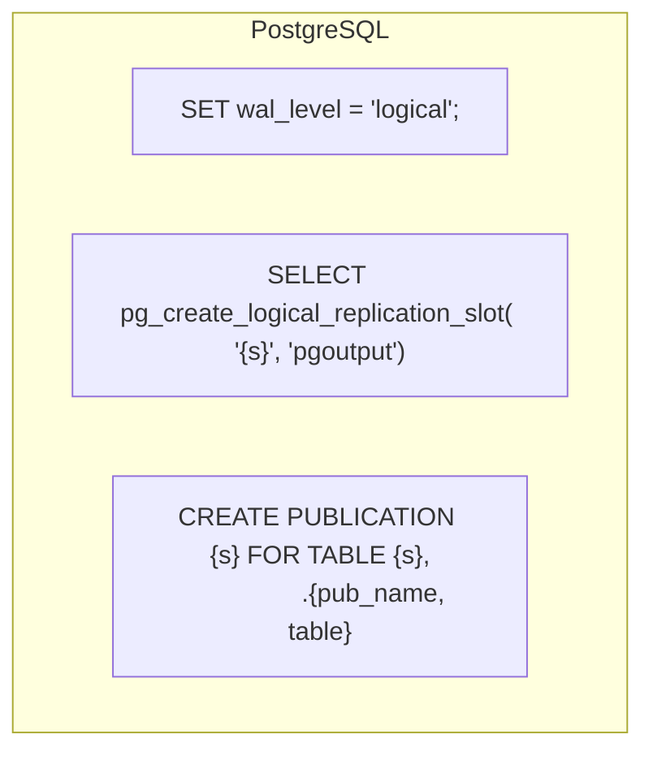
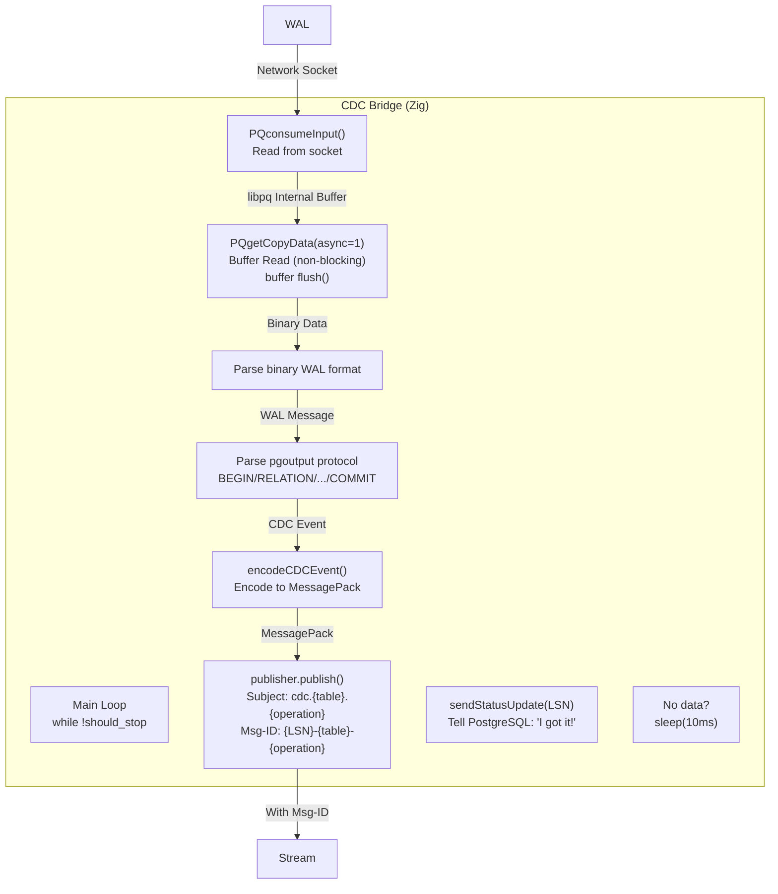
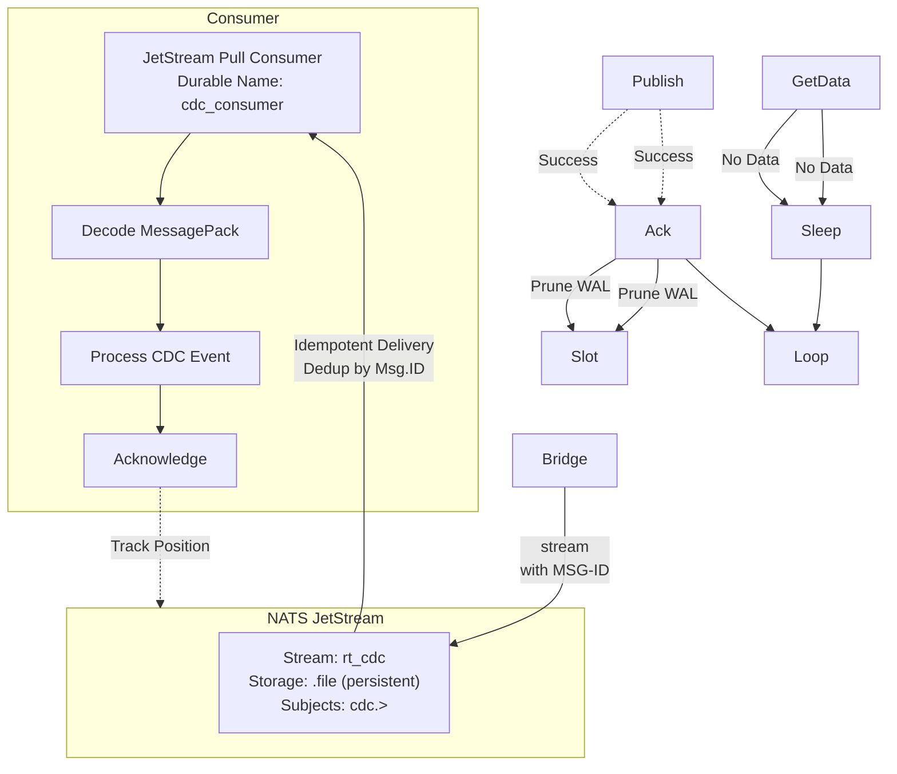
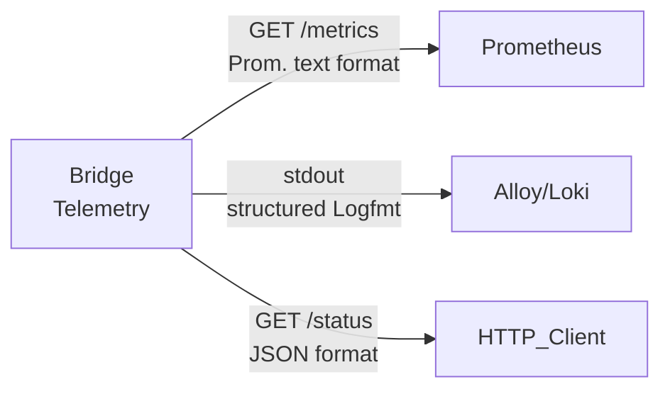

# POSTGRESQL-to-NATS bridge server

A Zig project to build a PostgreSQL bridge opiniated server to:

- stream Change Data Capture (CDC) to NATS JetStream
- bootstrap a PostgreSQL table via a NATS server
- MessagePack encoding


It uses the streams `CDC` and `INIT` to which NATS/JS consumers should subscribe or publish to.

The message are encoded with `MessagePack`.

It uses a NATS KV store with a bucket name "schemas" to hold the schemas of the tables of interest.

Consumers subscribe to the stream `INIT` and will receive on connection:

- the schemas through the topic `init.schema`:
  
```json
// topic: init.schema.<table>
%{"columns" => 
  [
    %{"column_default" => "nextval('users_id_seq'::regclass)", "data_type" => "integer", "is_nullable" => false, "name" => "id", "position" => 1}, 
    %{"column_default" => nil, "data_type" => "text", "is_nullable" => false, "name" => "name", "position" => 2}, 
    %{"column_default" => nil, "data_type" => "text", "is_nullable" => true, "name" => "email", "position" => 3}, 
    %{"column_default" => "now()", "data_type" => "timestamp with time zone", "is_nullable" => true, "name" => "created_at", "position" => 4}
  ],
  "schema" => "public.users", 
  "table" => "users", 
  "timestamp" => 1765201228
}
```

- metadata for the topic `init.meta` and a full snpashot of the table of interest for the topic `init.<table>`
  
```json
//topic: init.meta.<table>
%{
  "batch_count" => 4,
  "lsn" => "0/191BFD0",
  "row_count" => 4000,
  "snapshot_id" => "snap-1765208480",
  "table" => "users",
  "timestamp" => 1765208480
}

// topic: init.snap.<table>.snap-<snap-id>.<chunk_id>
%{
  "chunk" => 3,
  "data" => [
    %{
      "created_at" => "2025-12-08 13:45:21.719719+00",
      "email" => "user-0-2001@example.com",
      "id" => "3001",
      "name" => "User-0-2001"
    },
    ...
  ]
}%
```

```sh
./bridge --port 9090 --table tab_1,tab_2 --stream CDC,INIT --slot bridge
```

> [!NOTE] PostgreSQL replication slots are single threaded. If you need more replicas, open another port and another slot.

It provides basic telemetry to monitor the WAL lag size, via logs to SDTOUT and Prometheus ready at the endpoint ":9090/metrics".

## Test

```sh
docker compose -f docker-compose.prod.yml --env-file .env.prod up --build -d
```

```sh
docker compose -f docker-compose.prod.yml --env-file .env.prod up postgres nats-server nats-init nats-conf-gen
```

```sh
docker compose -f docker-compose.prod.yml --env-file .env.prod up bridge-init bridge --build -d
```

## Setup/Features

The NATS/JS setup should create the two streams.
PostgreSQL should contain the tables of interest.

JetStream must be enabled and a KV store should be created

Example of NATS setup:

```yml
nats-init:
    image: natsio/nats-box:latest
    container_name: nats-init
    networks:
      - cdc-bridge
    depends_on:
      - nats-server
    command:
      - sh
      - -c
      - |
        set -e
        until nats server check connection --server=nats://nats-server:4222 2>/dev/null; do
          sleep 1
        done

        nats stream add CDC --server=nats://nats-server:4222 --subjects='cdc.>' --storage=file --retention=limits --max-age=1m --max-msgs=1000000 --max-bytes=1G --replicas=1 --defaults || true

        nats stream add INIT --server=nats://nats-server:4222 --subjects='init.>' --storage=file --retention=limits --max-age=7d --max-msgs=10000000 --max-bytes=100G --replicas=1 --defaults || true
 
        nats kv add schemas --server=nats://nats-server:4222 --history=10 --replicas=1 || true
 
        exit 0
    restart: "no"

```

## Features

- PostgreSQL logical replication setup (replication slots & publications)
- NATS/JetStream integration for reliable message streaming
- Self-contained build using vendored nats.c library
- **MessagePack encoding** - Binary format for efficient serialization
- **Graceful shutdown** - Signal handling (SIGINT/SIGTERM)
- **Non-blocking I/O** - Efficient polling with 10ms sleep when idle
- **Automatic reconnection** - Handles connection failures with exponential backoff
- **Arena allocator** - Optimized temporary allocations per message
  
## Architecture

batch_publisher.zig: Return max LSN from flush operations
bridge.zig: Only set pending_ack_lsn after successful NATS flush
Optional: Add a callback mechanism so async flush can signal completion
This guarantees at-least-once delivery to NATS, with the replication slot protecting against data loss between PG and NATS.

- PostgreSQL setup:



- WAL digest flow:





### Key Flow Points

1. **Non-blocking I/O Loop**
   - `PQconsumeInput()` pulls data from network socket into libpq's internal buffer
   - `PQgetCopyData(async=1)` reads from buffer without blocking
   - Allows signal handler to work (Ctrl+C for graceful shutdown)

2. **WAL Acknowledgment**
   - `sendStatusUpdate(LSN)` tells PostgreSQL which WAL position was processed
   - PostgreSQL can safely prune WAL data from replication slot
   - Prevents unbounded WAL growth

3. **Idempotent Delivery**
   - Message ID: `{LSN}-{table}-{operation}` (e.g., `25cb3c8-users-insert`)
   - NATS JetStream deduplicates by Msg-ID
   - Ensures exactly-once semantics even with retries

4. **Durability**
   - **Stream persistence**: `.storage = .file` (Zig/NATS)
   - **Consumer position**: `durable_name` (Elixir/Gnat)
   - Both survive restarts

- PostgreSQL logical replication setup (replication slots & publications)
- NATS JetStream integration for reliable message streaming
- Self-contained build using vendored nats.c library
- **MessagePack encoding** - Binary format for efficient serialization
- **Graceful shutdown** - Signal handling (SIGINT/SIGTERM)
- **Non-blocking I/O** - Efficient polling with 10ms sleep when idle
- **Automatic reconnection** - Handles connection failures with exponential backoff
- **Arena allocator** - Optimized temporary allocations per message

## Prerequisites

- Zig 0.15.1 or later
- Docker & Docker Compose (for PostgreSQL and NATS)
- CMake (for building nats.c library)

## Build Instructions

### 1. Build the nats.c library (one-time setup)

```bash
./build_nats.sh
./build_libpq.sh
```

This compiles:

- nats.c v3.12.0 and installs it to `libs/nats-install/`
- `libpq` for Postgres v18.1 (same version as the Postgres server image)

### 2. Start infrastructure

```bash
# Start PostgreSQL with logical replication enabled
docker compose up -d postgres

# Start NATS server with JetStream enabled
docker compose up -d nats
```

### 3. Build the project

```bash
zig build
```

## Available Build Targets

```bash
# Build all executables (default)
zig build

# Run the main CDC bridge
zig build run
# or directly:
./zig-out/bin/bridge --stream CDC_BRIDGE

# Run tests
zig build test
```

## Project Structure

```txt
├── src/
│   ├── main.zig           # Main application entry point
│   ├── root.zig           # Library module root
│   ├── cdc.zig            # CDC consumer (replication slots, publications)
│   ├── nats_publisher.zig # NATS JetStream publisher
│   ├── nats_test.zig      # NATS connection test
│   ├── pg_test.zig        # PostgreSQL connection test
│   └── cdc_demo.zig       # Full CDC pipeline demo
├── libs/
│   ├── nats.c/            # Vendored nats.c v3.12.0 source
│   └── nats-install/      # Built nats.c library (created by build_nats.sh)
├── build.zig              # Zig build configuration
├── build.zig.zon          # Package dependencies
├── docker-compose.yml     # Infrastructure setup
└── nats-server.conf       # NATS JetStream configuration
```

## Dependencies

Managed via `build.zig.zon`:

- [zig-msgpack](https://github.com/zigcc/zig-msgpack) - MessagePack encoding
- Option for tests: [pg.zig](https://github.com/karlseguin/pg.zig) - PostgreSQL client

Vendored:

- [nats.c](https://github.com/nats-io/nats.c) v3.12.0 - NATS client (C library)
- [libpq](https://www.postgresql.org/docs/current/libpq.html) PostgreSQL 18.1

## Configuration

The PostgeSQL and NATS server are run via the Docker daemon (_docker-compose.yml_).

- Postgres:
  - Port: 5432
  - User: postgres
  - Password: postgres
  - Logical replication: enabled (`wal_level=logical`)

- nats:
  - Port: 4222
  - JetStream: enabled (`-js`)
  - Storage: `./nats-data` (1GB memory, 10GB file)

- Bridge HTTP Server:
  - Port: 8080
  - Endpoints: health, status, metrics, streams management, shutdown

- WAL Monitor:
  - Check interval: 30 seconds
  - Monitors replication slot lag and status

## Running the Bridge

Start the bridge with:

```bash
./zig-out/bin/bridge --stream CDC_BRIDGE
# or with custom HTTP port:
./zig-out/bin/bridge --stream CDC_BRIDGE --port 9090
```

**Available options:**

- `--stream <NAME>` - NATS JetStream stream name (default: CDC_BRIDGE)
- `--port <PORT>` - HTTP server port (default: 8080)
- `--help, -h` - Show help message

The bridge will:

1. Set up replication slot (`bridge_slot`) and publication (`bridge_pub`)
2. Connect to NATS JetStream and create the specified stream
3. Start HTTP server on specified port (health, metrics, stream management)
4. Start WAL lag monitor (checks every 30 seconds)
5. Begin streaming CDC events from PostgreSQL to NATS
6. Send keepalive messages every 30 seconds to prevent timeout
7. Log structured metrics every 15 seconds for observability

**Generate test events:**

```bash
cd consumer && NATS_STREAM_NAME=CDC_BRIDGE iex -S mix
iex> Producer.run_test(100)  # Generate 100 INSERT events
```

The bridge runs continuously until stopped with `Ctrl+C` or via `POST /shutdown`.

## Production Features

The bridge includes production-ready features:

- ✅ **WAL streaming protocol parser** - Full pgoutput binary format support (BEGIN/RELATION/INSERT/UPDATE/DELETE/COMMIT)
- ✅ **MessagePack encoding** - Efficient binary serialization of CDC events
- ✅ **Continuous streaming loop** - Non-blocking I/O with 10ms sleep when idle
- ✅ **Error handling** - Automatic reconnection with exponential backoff on connection failures
- ✅ **Monitoring** - Prometheus metrics, JSON status endpoint, structured logs for Alloy/Loki
- ✅ **Graceful shutdown** - Signal handling (SIGINT/SIGTERM) and HTTP shutdown endpoint
- ✅ **Keepalive management** - Bidirectional keepalives every 30s, responds to PostgreSQL keepalive requests
- ✅ **WAL lag monitoring** - Background thread monitors replication slot lag every 30s
- ✅ **Idempotent delivery** - Message deduplication via LSN-based message IDs
- ✅ **Thread-safe metrics** - Mutex-protected metric updates from multiple threads

## NATS Stream Management

The bridge provides comprehensive JetStream stream management capabilities through both HTTP endpoints and integration with downstream consumers.

### Architecture: One Bridge Instance per Stream

**Important:** The bridge is designed to run one replication slot for one stream. If you need to capture a different slot or assign another stream, run a new bridge instance.

This design choice provides:

- **Independent failure domains** - Each bridge/stream can fail independently
- **Independent scaling** - Different streams can have different resource allocations
- **Independent replay** - Each replication slot tracks its own LSN position
- **Operational simplicity** - One slot = one bridge = one stream

**To publish CDC events to multiple streams:**

Run multiple bridge instances, each with its own replication slot and stream:

```bash
# Terminal 1: Stream for real-time processing
./zig-out/bin/bridge --stream CDC_REALTIME

# Terminal 2: Stream for analytics (separate slot: bridge_analytics_slot)
# Requires code change to use different slot_name and publication_name
./zig-out/bin/bridge --stream CDC_ANALYTICS
```

**HTTP stream management endpoints** are provided for administrative tasks:

- Creating test streams for validation and debugging
- Managing streams used by other services (not this bridge)
- Cleaning up streams (purge/delete)

They do **not** allow switching the bridge's target stream at runtime - that requires restarting the bridge with a new `--stream` parameter. The bridge automatically creates its target stream on startup.

### Stream Architecture

**Bridge (Zig)** - Stream Producer & Manager:

- Creates streams with persistent `.file` storage
- Publishes CDC events with message deduplication (Msg-ID)
- Manages stream lifecycle via HTTP API

**Consumer (Elixir/Gnat)** - Stream Subscriber:

- Sets `durable_name` for consumer position tracking
- Survives restarts (durable consumer)
- Handles redelivery on failures (NAK on error)
- Processes messages in order
- Acknowledges successful processing (ACK)

### JetStream Guarantees

The combination of stream persistence and durable consumers provides:

- **Persistence**: Messages survive server restarts (`.file` storage)
- **Ordering**: Messages delivered in sequence order
- **Exactly-once semantics**: Message deduplication by Msg-ID (`{LSN}-{table}-{operation}`)
- **Durability**: Consumer position tracked across restarts (`durable_name`)
- **Reliability**: Automatic redelivery on failure (NAK)

### HTTP Management Endpoints

The bridge exposes stream management operations at `http://localhost:8080/streams/*`:

**Get stream information:**

```sh
curl "http://localhost:8080/streams/info?stream=CDC_BRIDGE"
```

Returns JSON with stream statistics (message count, bytes, first/last sequence, consumer count).

**Create a new stream:**

```sh
curl -X POST "http://localhost:8080/streams/create?stream=TEST&subjects=test.>"
```

Creates a stream with persistent `.file` storage, 1GB max bytes, 1M max messages, 1 minute max age.

**Delete a stream:**

```sh
curl -X POST "http://localhost:8080/streams/delete?stream=TEST"
```

Permanently removes the stream and all its messages.

**Purge stream messages:**

```sh
curl -X POST "http://localhost:8080/streams/purge?stream=TEST"
```

Removes all messages from the stream while keeping the stream configuration.

### Consumer Management (Elixir/Gnat)

Downstream consumers can interact with streams using the Gnat JetStream API:

**List all streams:**

```elixir
iex> Gnat.Jetstream.API.Stream.list(:gnat)
{:ok, %{offset: 0, total: 2, limit: 1024, streams: ["CDC_BRIDGE", "TEST"]}}
```

**Get stream details:**

```elixir
iex> Gnat.Jetstream.API.Stream.info(:gnat, "CDC_BRIDGE")
{:ok, %{config: %{...}, state: %{messages: 1234, bytes: 56789, ...}}}
```

**Purge stream:**

```elixir
iex> Gnat.Jetstream.API.Stream.purge(:gnat, "CDC_BRIDGE")
:ok
```

## Health Check

The bridge provides a simple health check endpoint for monitoring and orchestration tools (Docker, Kubernetes, load balancers, etc.):

**HTTP GET** `http://localhost:8080/health`

Returns:

```json
{"status":"ok"}
```

**Status:** `200 OK` when the bridge HTTP server is running.

## Control Endpoints

### Graceful Shutdown

**HTTP POST** `http://localhost:8080/shutdown`

Initiates a graceful shutdown of the bridge:

```sh
curl -X POST http://localhost:8080/shutdown
```

Returns `Shutdown initiated` and triggers the same graceful shutdown sequence as `Ctrl+C`:

1. Sets the global shutdown flag
2. Completes processing of any in-flight WAL messages
3. Sends final status update to PostgreSQL
4. Closes all connections cleanly
5. Joins background threads (HTTP server, WAL monitor)
6. Exits with summary statistics

This is useful for orchestration tools, deployment scripts, or automated testing.

## Telemetry

The bridge provides comprehensive telemetry through multiple channels for TimeSerie DataBases



### 1. Prometheus Metrics Endpoint

**HTTP GET** `http://localhost:8080/metrics`

Returns metrics in Prometheus text format:

```prometheus
bridge_uptime_seconds 45
bridge_wal_messages_received_total 1797
bridge_cdc_events_published_total 288
bridge_last_ack_lsn 25509096
bridge_connected 1
bridge_reconnects_total 0
bridge_last_processing_time_us 2
bridge_slot_active 1
bridge_wal_lag_bytes 51344
```

Configure Prometheus to scrape this endpoint.

### 2. JSON Status Endpoint

**HTTP GET** `http://localhost:8080/status`

Returns bridge status as JSON for programmatic access:

```json
{
  "status": "connected",
  "uptime_seconds": 331,
  "wal_messages_received": 1797,
  "cdc_events_published": 288,
  "current_lsn": "0/1832ce8",
  "is_connected": true,
  "reconnect_count": 0,
  "last_processing_time_us": 2,
  "slot_active": true,
  "wal_lag_bytes": 51344,
  "wal_lag_mb": 0
}
```

### 3. Structured Log Metrics (for Grafana Alloy/Loki)

The bridge emits structured metric logs to **stdout** every **15 seconds**:

```log
info(bridge): METRICS uptime=15 wal_messages=2 cdc_events=0 lsn=0/183f680 connected=1 reconnects=0 lag_bytes=51608 slot_active=1 processing_time_us=0
```

Configure Grafana Alloy to parse these logs and extract metrics using regex or logfmt parser.

**Example Alloy config snippet:**

```hcl
loki.source.file "bridge_logs" {
  targets = [
    {__path__ = "/var/log/bridge/*.log"},
  ]
  forward_to = [loki.process.extract_metrics.receiver]
}

loki.process "extract_metrics" {
  stage.regex {
    expression = "METRICS uptime=(?P<uptime>\\d+) wal_messages=(?P<wal_msgs>\\d+) cdc_events=(?P<cdc_events>\\d+)"
  }

  stage.metrics {
    metric.counter {
      name   = "bridge_wal_messages_total"
      source = "wal_msgs"
    }
    metric.counter {
      name   = "bridge_cdc_events_total"
      source = "cdc_events"
    }
  }

  forward_to = [loki.write.default.receiver]
}
```

## WAL parsing

The RelationMessage ('R') comes before any Insert/Update/Delete messages and tells you: Column names, Column type OIDs (for decodeColumnData), Type modifiers.

Without caching it, you can't decode the tuple data because Tuple data only has raw bytes - no column names or type info.
You need the type_id from the RelationMessage to call decodeColumnData(type_id, raw_bytes).
RelationMessages are sent once per table at the start, then only Insert/Update/Delete messages follow.

## PostgreSQL Configuration

### WAL Sender Timeout

PostgreSQL's default `wal_sender_timeout` is 1 minute:

```sh
docker exec -it postgres psql -U postgres -c "SHOW wal_sender_timeout;"
# wal_sender_timeout
# --------------------
#  1min
```

**Solution implemented:** The bridge sends keepalive messages every 30 seconds and flushes them immediately with `PQflush()`. For additional safety, you can increase the timeout to 5 minutes by adding to `docker-compose.yml`:

```yaml
postgres:
  command: postgres -c wal_sender_timeout=300s
```

## Testing

### End-to-End CDC Pipeline Test

**Terminal 1 - Start the bridge:**

```sh
./zig-out/bin/bridge --stream CDC_BRIDGE
```

**Terminal 2 - Generate CDC events:**

```sh
cd consumer && NATS_STREAM_NAME=CDC_BRIDGE iex -S mix

# Generate 100 INSERT events
iex> Producer.run_test(100)

# Parallel load test: 100 batches of 10 events each
iex> Stream.interval(500) |> Stream.take(100) |> Task.async_stream(fn _ -> Producer.run_test(10) end) |> Enum.to_list()
```

```sh
docker exec postgres psql -U postgres -c "CREATE TABLE users (id SERIAL PRIMARY KEY, name TEXT NOT NULL, email TEXT, created_at TIMESTAMPTZ DEFAULT now());"
```

### HTTP Endpoint Tests

**Health check:**

```sh
curl http://localhost:8080/health
# => {"status":"ok"}
```

**Bridge status:**

```sh
curl http://localhost:8080/status | jq
# => Shows uptime, message counts, LSN, connection status, WAL lag, etc.
```

**Prometheus metrics:**

```sh
curl http://localhost:8080/metrics
# => Prometheus text format metrics
```

**Stream management:**

```sh
# Get stream info
curl "http://localhost:8080/streams/info?stream=CDC_BRIDGE" | jq

# Create a test stream
curl -X POST "http://localhost:8080/streams/create?stream=TEST&subjects=test.>"

# Purge stream messages
curl -X POST "http://localhost:8080/streams/purge?stream=TEST"

# Delete stream
curl -X POST "http://localhost:8080/streams/delete?stream=TEST"
```

**Graceful shutdown:**

```sh
curl -X POST http://localhost:8080/shutdown
# => Bridge will shut down gracefully
```

### Monitoring Replication Slot

```sh
# Check PostgreSQL replication slot status
docker exec -it postgres psql -U postgres -c "
  SELECT slot_name, active,
         pg_size_pretty(pg_wal_lsn_diff(pg_current_wal_lsn(), restart_lsn)) as lag
  FROM pg_replication_slots
  WHERE slot_name = 'bridge_slot';
"
```

## Notes

- The nats.c library is built with TLS enabled.
- The library is statically linked to avoid runtime dependencies
- PostgreSQL logical replication requires `wal_level=logical`
- All C code is compiled with `-std=c11`

Kill my zombies!!!

```sh
ps aux | grep bridge | grep -v grep
```

## License

This project uses:

- nats.c (Apache 2.0)
- zig-msgpack (MIT)

## SCSCP

Atomic operations guarantee atomicity - the operation completes as a single, indivisible unit that can't be interrupted or observed in a partial state by other threads. This is more than just taking a snapshot. For example:
const value = self.write_index.load(.monotonic);  // Atomic read
This guarantees:
Atomicity: The read happens as one operation (no torn reads on 64-bit values)
Thread-safety: No data races even with concurrent access
Memory ordering: Controls visibility of other memory operations (explained below)
Memory Ordering: .monotonic vs .acquire vs .release
Memory ordering controls when other threads see the effects of your operations. This is crucial for lock-free algorithms.
.monotonic (Relaxed)
Guarantees: Only the atomicity of THIS operation
Does NOT guarantee: Any ordering with respect to other memory operations
Use case: When you just need an atomic read/write but don't care about synchronization with other operations
const current_write = self.write_index.load(.monotonic);
// Just reading the index value atomically
// No guarantees about seeing other thread's non-atomic writes
.acquire (Acquire)
Guarantees: All memory operations AFTER this acquire in your code will see the effects of operations that happened BEFORE the corresponding release in another thread
Use case: Reading data that another thread published
const current_write = self.write_index.load(.acquire);
// Now I can safely read buffer[i] because I'm guaranteed to see
// the data that the producer wrote BEFORE it did release store
.release (Release)
Guarantees: All memory operations BEFORE this release in your code will be visible to threads that do a corresponding acquire
Use case: Publishing data for another thread to read
self.buffer[index] = item;  // Write data first
self.write_index.store(next_index, .release);
// Release ensures buffer write is visible before index update
.seq_cst (Sequentially Consistent)
Guarantees: Strongest ordering - total global order of all seq_cst operations
Use case: When you need the strictest guarantees (but it's slower)

pub fn push(self: *Self, item: T) error{QueueFull}!void {
    const current_write = self.write_index.load(.monotonic);  // [1]
    const current_read = self.read_index.load(.acquire);      // [2]
    
    // Check if full...
    
    self.buffer[current_write] = item;  // [3] Write data
    
    self.write_index.store(next_write, .release);  // [4] Publish
}
Line [1]: .monotonic - We just need our own current write position, no synchronization needed
Line [2]: .acquire - We need to see if consumer freed up space (see the latest read_index from consumer's .release)
Line [3]: Normal write to buffer
Line [4]: .release - Ensures data write [3] is visible before index update. Consumer will see this with .acquire
Consumer (pop):
pub fn pop(self: *Self) ?T {
    const current_read = self.read_index.load(.monotonic);   // [1]
    const current_write = self.write_index.load(.acquire);   // [2]
    
    // Check if empty...
    
    const item = self.buffer[current_read];  // [3] Read data
    
    self.read_index.store(next_read, .release);  // [4] Free slot
    return item;
}
Line [1]: .monotonic - Just need our own read position
Line [2]: .acquire - This synchronizes with producer's .release at [4]. Now we're guaranteed to see the data written at [3]
Line [3]: Read the data (safe because of acquire/release pairing)
Line [4]: .release - Tell producer this slot is free (producer will see this with its .acquire)
The Acquire/Release Contract
Think of it as a happens-before relationship:
Producer Thread:              Consumer Thread:
------------------           ------------------
buffer[5] = data             
write_index.store(6, .release)  →  write_index.load(.acquire)
                                   item = buffer[5]  ✓ sees data
Without proper ordering, the consumer might see the updated write_index but stale data in the buffer due to CPU reordering or cache coherency delays.
Why Not Always Use .seq_cst?
.seq_cst is the safest but slowest. For SPSC queues, we can use cheaper orderings because:
Only 2 threads (producer/consumer)
Clear ownership model (each index owned by one thread)
Acquire/release is sufficient for the synchronization we need
Your SPSC queue uses the optimal memory orderings for maximum performance while maintaining correctness!The Two-Stage Architecture
Stage 1: Lock-Free Queue (TRUE Concurrency)
// In AsyncBatchPublisher struct (line 18)
event_queue: SPSCQueue(batch_publisher.CDCEvent),
Main thread (producer) calls addEvent() which:
Copies metadata strings to heap
Takes ownership of columns ArrayList
Pushes CDCEvent to lock-free SPSC queue (line 119)
Flush thread (consumer) in flushLoop():
Pops CDCEvent from lock-free SPSC queue (line 180)
Transfers ownership to its own private ArrayList
Stage 2: Private ArrayList (NO Concurrency)
// In flushLoop() - line 167
var batch = std.ArrayList(batch_publisher.CDCEvent){};
This ArrayList is local to the flush thread only. The main thread never touches it.
Where TRUE Concurrency Happens
The concurrent read/write happens at the SPSC queue boundary:
Main thread writes to event_queue via atomic write_index (spsc_queue.zig:80)
Flush thread reads from event_queue via atomic read_index (spsc_queue.zig:104)
These operations happen simultaneously:
While flush thread is draining events at index 100-199
Main thread is pushing new events at index 200-299
No locks, just atomic index updates with memory ordering
Why This Design?
The SPSC queue provides:
Wait-free operations: Push/pop never block
Cache-friendly: Separate cache lines for indices (line 30-31)
Backpressure: Queue full → main thread yields (line 129)
Zero contention on ArrayList: Each thread owns its own
What Would Happen Without Lock-Free Queue?
If we used a shared mutex-protected ArrayList:
// BAD: Shared ArrayList with mutex
var shared_batch: std.ArrayList(CDCEvent) = ...;
var mutex: std.Thread.Mutex = ...;

// Main thread blocks during flush!
mutex.lock();
try shared_batch.append(event);
mutex.unlock();
This would cause:
Main thread blocks while flush thread holds mutex
Flush thread blocks while main thread adds events
Terrible throughput under load
