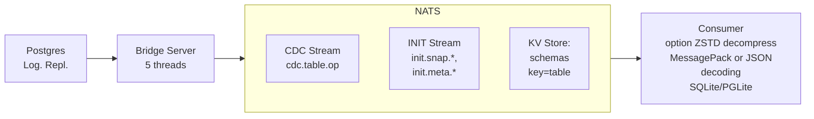

# PostgreSQL CDC → NATS Bridge


A lightweight (15MB), opinionated bridge for streaming PostgreSQL _proto-v1_ changes to NATS JetStream with default MessagePack encoding (and JSON option).

Built with Zig for minimal overhead, includes table bootstrapping for consumer initialization with optional ZSTD compression

⚠️ **Status**: Early stage, not yet battle-tested in production. Suitable for experimentation and non-critical workloads.



## Table of Contents

- [Overview](#overview)
- [Design Philosophy](#design-philosophy)
- [Prerequisites](#prerequisites)
- [Consumer Integration Guide](#consumer-integration-guide)
- [Running the Bridge](#running-the-bridge)
- [Message Formats](#message-formats)
- [Monitoring & Telemetry](#monitoring--telemetry)
- [Safety & Guarantees](#safety--guarantees)
- [Architecture](#architecture)
- [Comparison to Alternatives](#comparison-to-alternatives)
- [Build Instructions](#build-instructions)
- [Configuration](#configuration)

---

## Overview

We use NATS JetStream to solve the problem of distributing PostgreSQL's logical replication as both solve the hard problems: ordering, durability, idempotency.

The bridge just connects them correctly.

This bridge is an **experiment in minimalism**: can PostgreSQL CDC be done with 16MB and 7MB RAM while preserving correctness?

The design makes deliberate trade-offs for simplicity and efficiency.

### What It Does

We have a _pull_ model subscribing to the WAL.
We use the plugin `pgoutput` to receive formatted data from Postgres.

**Uses Protocol v1**:

The plugin `pgoutput` will send data after the transaction is commited.

The upwards versions 2,3,4 are not implemented.
Version 2 introduced _streaming transactions_.
Version 3 introduced row filtering (eg only replicate rows where user_id > 1000) and column filtering.

**Two-phase data flow:**

1. **Bootstrap** (INIT stream): Consumer requests table snapshot → receives data in  optionaly `ZSTD` compressed and `MessagePack` or `JSON` encoded
2. **Real-time CDC** (CDC stream): Consumer receives INSERT/UPDATE/DELETE events as they happen MessagePack or JSON encoded

**Key features:**

- Streams PostgreSQL changes using logical replication (pgoutput format)
- Publishes schemas to NATS KV store on startup
- Generates table snapshots on-demand (10K row chunks) via NATS requests
- **Optional zstd compression** for snapshots (90-95% compression with per-table dictionaries)
- Triggers message to NATS on schema change
- MessagePack default encoding or JSON available with `--json`
- At-least-once delivery with idempotent message IDs
- Graceful shutdown with LSN acknowledgment
- 16MB Docker image, 7MB RAM usage
- ~+60K events/s throughput (single-threaded)
- telemetry via HTTP `/metrics` (Prometheus format) and Logs structured metrics to stdout (Grafana Loki)

### Use Case

Consumers wanting to mirror PostgreSQL tables locally (SQLite, PGLite, etc.) and stay synchronized with real-time changes.

**Example:** Edge applications, mobile apps, or analytics workers that need a local replica of specific tables without querying the main database.

---

## Design Philosophy


### 1. Encoding

**Default: MessagePack**
- Compact (~30% smaller than JSON)
- Type-safe (_preserves_ int/float/binary distinctions) whilst JSON sends strings.
- Fast encoding/decoding

**Alternative: JSON**: use flag `--json` for browser compatibility (NATS supports WebSocket connections) but slightly larger payload size and slower encoding/decoding.

### 2. Snapshot Compression (Optional)

**Opt-in zstd compression** with `--zstd` flag:

- **90-95% compression** for snapshots with per-table dictionaries
- **2-3× smaller payloads** vs generic compression
- **12× faster uploads** for large snapshots
- Falls back to ~70% compression without dictionaries

**When to use:**

- Large table snapshots (>100MB)
- Low-bandwidth clients (mobile, edge)
- High data transfer costs

See [COMPRESSION.md](COMPRESSION.md) for dictionary training and client integration.

### 3. Single-Threaded per Bridge

**Design choice:** One bridge instance = one replication slot = sequential processing

**Rationale:**
- PostgreSQL WAL is inherently sequential
- Simpler LSN acknowledgment logic
- Scale horizontally (multiple bridges) instead of vertically

**To scale throughput:**: the PostgreSQL admin creates the publication and scope (_pub_name_ for which tables).

```bash
# Bridge 1: 60K events/s for table "users" with publication "my_pub_1"
./bridge --slot slot_1 --pub my_pub_1 --port 9090

# Bridge 2: Another 60K events/s for table "orders" with publication "my_pub_2"
./bridge --slot slot_2 --pub my_pub_2 --port 9091
```

**Trade-off:** Multiple processes vs single multi-threaded process. This approach prioritizes operational simplicity.

### 3. Bridge ACK Flow

```txt
PostgreSQL WAL → Bridge → NATS JetStream
              ↑            ↓
              └─── ACK after JetStream confirms
```

1. Bridge receives WAL event from PostgreSQL
2. Bridge publishes to NATS JetStream (async)
3. **JetStream confirms** message is durably persisted (file storage)
4. Bridge ACKs that LSN to PostgreSQL
5. PostgreSQL can safely prune WAL up to that LSN

Bridge only ACKs after NATS has the data (no data loss). Then PostgreSQL can reclaim disk space safely.
If bridge crashes, PostgreSQL retains unpublished WAL

**Backpressure:**: NATS slow/full → Bridge can't get JetStream ACK → Bridge stops ACK'ing PostgreSQL → WAL accumulates

The NATS ACK flow remains "standard" outside of the bridge scope:

```txt
NATS JetStream → Consumer
       ↑              ↓
       └──── Consumer ACKs (or NAKs)
```

1. Consumer pulls messages from JetStream
2. Consumer processes message
3. Consumer ACKs to JetStream (or NAKs on error)
4. JetStream tracks consumer position (durable consumer)
5. JetStream can prune messages acknowledged by all consumers

The Consumer controls replay (NAK → redeliver). Durable consumer name survives restarts. Multiple consumers can track independent positions

**Backpressure:**: Consumer slow → JetStream buffers → Consumer catches up at own pace. JetStream retention policies prevent unbounded growth
.

### 4. Two-Stream Architecture

| Stream   | Purpose             | Retention     | Consumer Pattern        |
| -------- | ------------------- | ------------- | ----------------------- |
| **CDC**  | Real-time changes   | Short (1 min) | Continuous subscription |
| **INIT** | Bootstrap snapshots | Long (7 days) | One-time replay         |

Both streams have different retention policies.
Consumer requests snapshots on-demand (not auto-pushed)

### 5. On-Demand Snapshots

1. Bridge starts → publishes schemas to KV store immediately
2. Consumer fetches schemas when ready
3. Consumer publishes: `snapshot.request.{table}`
4. Bridge generates snapshot (COPY CSV, chunked)
5. Consumer reconstructs table from INIT stream
6. Consumer subscribes to CDC stream for updates

No unnecessary work (only snapshot tables consumers need). Consumer controls timing (e.g., off-peak hours) Non-blocking (bridge continues CDC while snapshotting)

---

## Prerequisites

### PostgreSQL Setup (by admin/DBA Task eg `postgres` user)

#### 1. Enable Logical Replication

Add to `postgresql.conf` or Docker command:

```sh
wal_level = logical
max_replication_slots = 10
max_wal_senders = 10
max_slot_wal_keep_size = 10GB
wal_sender_timeout = 300s  # 5 minutes
```

#### 2. Create Publication

The BDA create a publication say `my_pub` on specific tables 'users', 'orders':

```sql
CREATE PUBLICATION my_pub FOR TABLE users, orders;
```

Or for all tables:

```sql
-- Run as superuser
CREATE PUBLICATION my_pub FOR ALL TABLES;
```

#### 3. Create Bridge User

> [!NOTE] The bridge uses a restricted `bridge_reader` user for security. It should be restricted to SELECT on given tables + REPLICATION (least privilege).

The DBA creates:

```sql
-- Run as superuser
CREATE USER bridge_reader WITH REPLICATION PASSWORD 'secure_password';
GRANT CONNECT, CREATE ON DATABASE postgres TO bridge_reader;
GRANT USAGE ON SCHEMA public TO bridge_reader;
GRANT SELECT ON ALL TABLES IN SCHEMA public TO bridge_reader;

-- Auto-grant for future tables
ALTER DEFAULT PRIVILEGES IN SCHEMA public
    GRANT SELECT ON TABLES TO bridge_reader;
```

See `init.sh` for a complete setup script.

---

### NATS JetStream Setup (Admin Task)

The NATS admin must enable JetStream, create two streams 'CDC' and 'INIT' and a KV store 'schemas'.

#### 1. Enable JetStream

```sh
nats-server -js -m 8222
```

Or via Docker:

```bash
docker run -p 4222:4222 -p 8222:8222 nats:latest -js -m 8222
```

#### 2. Create Streams

```sh
# CDC stream: Short retention for real-time events
nats stream add CDC \
  --subjects='cdc.>' \
  --storage=file \
  --retention=limits \
  --max-age=1m \
  --max-msgs=1000000 \
  --max-bytes=1G \
  --replicas=1

# INIT stream: Long retention for bootstrap data
nats stream add INIT \
  --subjects='init.>' \
  --storage=file \
  --retention=limits \
  --max-age=7d \
  --max-msgs=10000000 \
  --max-bytes=8G \
  --replicas=1
```

#### 3. Create KV Bucket for Schemas

```sh
nats kv add schemas --history=10 --replicas=1
```

#### 4. Configure Authentication

Example `nats-server.conf` where we use `user | password`:

```yml
port: 4222

jetstream {
    store_dir: "/data"
    max_memory_store: 1GB
    max_file_store: 10GB
}

accounts {
  BRIDGE: {
    jetstream: {
      max_memory: 1GB
      max_file: 10GB
      max_streams: 10
      max_consumers: 10
    }
    users: [
      {user: "bridge_user", password: "bridge_password"}
    ]
  }
}
```

See `docker-compose.yml` for a complete Docker setup with PostgreSQL + NATS.

---

## Consumer Integration Guide

### Bootstrap Flow (First-Time Setup)

```txt
1. Consumer starts
2. Fetches schemas from NATS KV store
   GET kv://schemas/{table_name} → MessagePack schema
3. Checks if local DB needs bootstrap
4. If yes, publishes snapshot request
   PUBLISH snapshot.request.{table_name} (empty payload)
5. Bridge snapshot_listener receives request
6. Bridge generates snapshot in 10K row chunks
   → Publishes to init.snap.{table}.{snapshot_id}.{chunk}
7. Consumer receives chunks, reconstructs table
8. Consumer receives metadata on init.meta.{table}
9. Consumer subscribes to CDC stream for real-time updates
```

### Implementation Example (Elixir)

The native concurrency of the BEAM and Elixir makes it a natural candidate to consume "consistant" data.

If we passed `--json` to the bridge, we pass `FORMAT=json` to Elixir, and without, we pass `FORMAT=msgpack`.

```sh
NATS_USER=bridge_user NATS_PASSWORD=bridge_secure_password TABLES=users,test_types MIX_ENV=prod  PG_HOST=localhost PG_PORT=5432 PG_USER=postgres PG_PASSWORD=postgres_password PG_DB=postgres \
FORMAT=json \
iex -S mix
```

**1. Fetch Schemas**

```elixir
def fetch_schema(table_name) do
  case Gnat.Jetstream.API.KV.get_value(:gnat, "schemas", table_name) do
    schema_data when is_binary(schema_data) ->
      {:ok, schema} = Msgpax.unpack(schema_data)
      # schema = %{"table" => "users", "columns" => [...]}
    _ ->
      {:error, :not_found}
  end
end
```

**2. Request Snapshot**

```elixir
def request_snapshot(table_name) do
  # Check if INIT stream is empty (needs fresh snapshot)
  {:ok, stream_info} = Gnat.Jetstream.API.Stream.info(:gnat, "INIT")
  stream_messages = stream_info["state"]["messages"] || 0

  if stream_messages == 0 do
    # Request snapshot
    :ok = Gnat.pub(:gnat, "snapshot.request.#{table_name}", "")
    Logger.info("Requested snapshot for #{table_name}")
    :ok
  end
end
```

**3. Subscribe to INIT Stream**

```elixir
# Create durable consumer === persistent
consumer_config = %Gnat.Jetstream.API.Consumer{
  durable_name: "my_init_consumer",
  stream_name: "INIT",
  filter_subject: "init.>",
  ack_policy: :explicit,
  ack_wait: 60_000_000_000,  # 60 seconds in nanoseconds
  max_deliver: 3
}

def handle_init_message(message) do
  {:ok, payload} = Msgpax.unpack(message.body)

  case payload do
    %{"operation" => "snapshot", "data" => rows} ->
      # Insert rows into local DB
      insert_bulk_rows(rows)
      {:ack, state}

    _ ->
      {:ack, state}
  end
end
```

**4. Subscribe to CDC Stream**

```elixir
consumer_config = %Gnat.Jetstream.API.Consumer{
  durable_name: "my_cdc_consumer",
  stream_name: "CDC",
  filter_subject: "cdc.users.>",  # Or "cdc.>" for all tables
  ack_policy: :explicit,
  max_batch: 100
}

def handle_cdc_message(message) do
  {:ok, payload} = Msgpax.unpack(message.body)

  case payload["operation"] do
    "INSERT" -> insert_row(payload["columns"])
    "UPDATE" -> update_row(payload["columns"])
    "DELETE" -> delete_row(payload["columns"])
  end

  {:ack, state}
end
```

See `consumer/lib/consumer/` for a complete Elixir example.

---

## Running the Bridge

> [!NOTE] We hardcoded the stream names "CDC" and "INIT".

The user of the bridge defines a `REPLICATION_SLOT` with the flag `--slot my_slot`. The bridge will create it.

### Command-Line Options

```txt
  --slot <NAME>     Mandatory: Replication slot name (default: cdc_slot)
  --pub <NAME>      Mandatory: use the Postgres `PUBLICATION`
  --port <PORT>     HTTP telemetry port (default: 9090)
  --json            Encoder option: defaults to `MessagePack`
  --help, -h        Show this help message
```

### Local Development (Bridge on Host Machine)

**Use case**: Development workflow where you run the bridge binary locally and connect to containerized PostgreSQL + NATS.

**Prerequisites**:

- PostgreSQL admin has created publication (e.g., `cdc_pub`) and bridge user (`bridge_reader`)
- NATS admin has created CDC/INIT streams, KV store, and credentials

**Step 1**: Start infrastructure containers:

```bash
docker compose \
  -f docker-compose.prod.yml \
  --env-file .env.prod up \
  postgres nats-server nats-init nats-config-gen -d
```

**Step 2**: Build the bridge locally:

```bash
zig build
```

**Step 3**: Run the bridge with environment variables:

```bash
PG_HOST=localhost \
PG_DB=postgres \
PG_PORT=5432 \
POSTGRES_BRIDGE_USER=bridge_reader \
POSTGRES_BRIDGE_PASSWORD=bridge_password_changeme \
NATS_BRIDGE_USER=bridge_user \
NATS_BRIDGE_PASSWORD=bridge_secure_password \
NATS_HOST=localhost \
./zig-out/bin/bridge --slot my_slot --pub cdc_pub

# With custom port and JSON encoding:
./zig-out/bin/bridge --slot my_slot --pub cdc_pub --port 9091 --json
```

**Environment variables reference**:

```bash
# PostgreSQL connection
PG_HOST=localhost          # PostgreSQL host
PG_PORT=5432              # PostgreSQL port
POSTGRES_BRIDGE_USER=bridge_reader
POSTGRES_BRIDGE_PASSWORD=bridge_password_changeme
PG_DB=postgres            # Database name

# NATS connection
NATS_HOST=localhost       # NATS server host
NATS_BRIDGE_USER=bridge_user
NATS_BRIDGE_PASSWORD=bridge_secure_password
```

### Production Deployment (Full Container Stack)

**Use case**: Running everything in containers for production or production-like environments.

**What runs in containers**:

- PostgreSQL (with logical replication enabled)
- NATS server (with JetStream)
- Bridge binary (compiled and containerized)

**Command**:

```bash
# Start full stack (PostgreSQL + NATS + Bridge)
docker compose -f docker-compose.prod.yml --env-file .env.prod up --build -d
```

This uses `docker-compose.prod.yml` which includes the bridge container alongside PostgreSQL and NATS. See that file for complete configuration.

### Horizontal Scaling

Run multiple bridge instances with different replication slots: you can go from 60K events/s to 120K events/s with two independant bridge server connected to the Postgres database and the NATS server.

```bash
# Terminal 1: 'pub_1' created for 'Users' table 
./bridge ---slot slot_1 --pub pub_1 --port 9090

# Terminal 2: 'pub_2' created for 'Orders' table
./bridge --slot slot_2  --pub pub_2 --port 9091
```

---

## Message Formats

Payloads use `MessagePack` binary encoding by default.

JSON can be enabled with the flag `--json`.

The examples below show the logical structure for illustration.

### Schema (KV Store: `schemas.{table}`)

Published at bridge startup. Consumers fetch before requesting snapshots.

```json
{
  "table": "users",
  "schema": "public.users",
  "timestamp": 1765201228,
  "columns": [
    {
      "name": "id",
      "position": 1,
      "data_type": "integer",
      "is_nullable": false,
      "column_default": "nextval('users_id_seq'::regclass)"
    },
    {
      "name": "name",
      "position": 2,
      "data_type": "text",
      "is_nullable": false,
      "column_default": null
    },
    {
      "name": "email",
      "position": 3,
      "data_type": "text",
      "is_nullable": true,
      "column_default": null
    }
  ]
}
```

### Snapshot Metadata (INIT Stream: `init.meta.{table}`)

Published after all chunks. Tells consumer how many chunks to expect.

```json
{
  "snapshot_id": "snap-1765208480",
  "lsn": "0/191BFD0",
  "timestamp": 1765208480,
  "batch_count": 4,
  "row_count": 4000,
  "table": "users"
}
```

### Snapshot Chunk (INIT Stream: `init.snap.{table}.{snapshot_id}.{chunk}`)

10,000 rows per chunk (configurable in `config.zig`).

```json
{
  "table": "users",
  "operation": "snapshot",
  "snapshot_id": "snap-1765208480",
  "chunk": 3,
  "lsn": "0/191BFD0",
  "data": [
    {
      "id": "3001",
      "name": "User-3001",
      "email": "user3001@example.com",
      "created_at": "2025-12-08 13:45:21.719719+00"
    },
    {
      "id": "3002",
      "name": "User-3002",
      "email": "user3002@example.com",
      "created_at": "2025-12-08 13:45:22.123456+00"
    }
    // ... up to 10,000 rows
  ]
}
```

### CDC Event (CDC Stream: `cdc.{table}.{operation}.{batch}`)

Real-time INSERT/UPDATE/DELETE events.

**Subject pattern:** `cdc.{table}.{operation}` with the test table 'test_types':

- `cdc.test_types.insert`
- `cdc.test_types.update`
- `cdc.test_types.delete`

**Message ID (for deduplication):** `{lsn}-{table}-{operation}`

Example: `"1851208-test_types-insert"`

**INSERT event:**

```json
{
  "data" => {
    "age" => 30,
    "created_at" => "2025-12-12T12:00:34.338547Z",
    "id" => 12,
    "is_true" => true,
    "matrix" => "{{1,2},{3,4}}",
    "metadata" => {
      "key_1" => "value_1",
      "key_2" => [[1, 2], [3, 4], [5, 6]],
      "key_3" => {"key_4" => "value_4", "key_5" => "value_5"}
    },
    "price" => "123.4500",
    "some_text" => "Sample text",
    "tags" => "{\"tag1\",\"tag2\"}",
    "temperature" => 36.6,
    "uid" => "f4b0611f-7258-47f8-bceb-0eba9ac5195a"
  },
  "msg_id" => "1851208-test_types-insert",
  "operation" => "INSERT",
  "relation_id" => 16392,
  "subject" => "cdc.test_types.insert",
  "table" => "test_types"
}
```

**UPDATE event:**

```json
{
  "data" => {
    "age" => 31,
    "created_at" => "2025-12-12T12:00:34.338547Z",
    "id" => 12,
    "is_true" => false,
    "matrix" => "{{1,2},{3,4}}",
    "metadata" => {
      "key_1" => "value_1",
      "key_2" => [[1, 2], [3, 4], [5, 6]],
      "key_3" => {"key_4" => "value_4", "key_5" => "value_5"}
    },
    "price" => "122.9905",
    "some_text" => "Sample text",
    "tags" => "{\"tag1\",\"tag2\"}",
    "temperature" => 37,
    "uid" => "f4b0611f-7258-47f8-bceb-0eba9ac5195a"
  },
  "msg_id" => "18513a8-test_types-update",
  "operation" => "UPDATE",
  "relation_id" => 16392,
  "subject" => "cdc.test_types.update",
  "table" => "test_types"
}
```

**DELETE event:**

```json
{
  "data" => {
    "age" => nil,
    "created_at" => nil,
    "id" => 12,
    "is_true" => nil,
    "matrix" => nil,
    "metadata" => nil,
    "price" => nil,
    "some_text" => nil,
    "tags" => nil,
    "temperature" => nil,
    "uid" => nil
  },
  "msg_id" => "1851518-test_types-delete",
  "operation" => "DELETE",
  "relation_id" => 16392,
  "subject" => "cdc.test_types.delete",
  "table" => "test_types"
}
```

---

## Monitoring & Telemetry

The bridge provides telemetry through multiple channels:


### 1. Prometheus Metrics Endpoint

**HTTP GET** `http://localhost:9090/metrics`

Returns metrics in Prometheus text format:

```prometheus
bridge_uptime_seconds 331
bridge_wal_messages_received_total 1797
bridge_cdc_events_published_total 288
bridge_last_ack_lsn 25509096
bridge_connected 1
bridge_reconnects_total 0
bridge_nats_reconnects_total 0
bridge_last_processing_time_us 2
bridge_slot_active 1
bridge_wal_lag_bytes 51344
```

Configure Prometheus to scrape this endpoint:

```yaml
scrape_configs:
  - job_name: 'cdc_bridge'
    static_configs:
      - targets: ['localhost:9090']
```

### 2. JSON Status Endpoint

**HTTP GET** `http://localhost:9090/status`

Returns bridge status as JSON:

```json
{
  "status": "connected",
  "uptime_seconds": 331,
  "wal_messages_received": 1797,
  "cdc_events_published": 288,
  "current_lsn": "0/1832ce8",
  "is_connected": true,
  "reconnect_count": 0,
  "nats_reconnect_count": 0,
  "last_processing_time_us": 2,
  "slot_active": true,
  "wal_lag_bytes": 51344,
  "wal_lag_mb": 0
}
```

### 3. Structured Log Metrics (for Grafana Alloy/Loki)

The bridge emits structured metric logs to **stdout** every **15 seconds**:

```log
info(bridge): METRICS uptime=15 wal_messages=2 cdc_events=0 lsn=0/183f680 connected=1 reconnects=0 nats_reconnects=0 lag_bytes=51608 slot_active=1
```

Configure Grafana Alloy to parse these logs:

```hcl
loki.source.file "bridge_logs" {
  targets = [
    {__path__ = "/var/log/bridge/*.log"},
  ]
  forward_to = [loki.process.extract_metrics.receiver]
}

loki.process "extract_metrics" {
  stage.regex {
    expression = "METRICS uptime=(?P<uptime>\\d+) wal_messages=(?P<wal_msgs>\\d+) cdc_events=(?P<cdc_events>\\d+)"
  }

  stage.metrics {
    metric.counter {
      name   = "bridge_wal_messages_total"
      source = "wal_msgs"
    }
    metric.counter {
      name   = "bridge_cdc_events_total"
      source = "cdc_events"
    }
  }

  forward_to = [loki.write.default.receiver]
}
```

### 4. Health Check Endpoint

**HTTP GET** `http://localhost:9090/health`

Returns:
```json
{"status":"ok"}
```

Status: `200 OK` when bridge HTTP server is running.

Use for Docker health checks, Kubernetes probes, or load balancers.

### 5. Graceful Shutdown Endpoint

**HTTP POST** `http://localhost:9090/shutdown`

Initiates graceful shutdown:

```bash
curl -X POST http://localhost:9090/shutdown
```

Shutdown sequence:
1. Sets global shutdown flag
2. Drains internal event queue
3. Sends final ACK to PostgreSQL
4. Closes connections cleanly
5. Exits with summary statistics

### 6. Stream Management Endpoints

**Get stream info:**

```bash
curl "http://localhost:9090/streams/info?stream=CDC" | jq
```

---

## Safety & Guarantees

### At-Least-Once Delivery

**The guarantee:**
- Bridge only ACKs to PostgreSQL **after** NATS JetStream confirms receipt
- PostgreSQL can safely prune WAL after ACK
- No data loss between Postgres and NATS

**If bridge crashes:**
- PostgreSQL retains WAL from last ACK'd LSN
- Bridge restarts from last ACK'd position
- JetStream deduplication (Msg-ID) prevents duplicates

**If NATS crashes:**
- Bridge stops ACK'ing to PostgreSQL
- WAL accumulates (up to `max_slot_wal_keep_size=10GB`)
- NATS recovers → Bridge resumes publishing
- No data loss (WAL preserved)

### Idempotent Delivery

**Message ID pattern:** `{lsn}-{table}-{operation}`
- Example: `25cb3c8-users-insert`

**NATS JetStream deduplication:**
- Duplicate Msg-IDs are rejected
- Ensures exactly-once semantics even with retries

### Durability

**PostgreSQL side:**
- Logical replication slot preserves WAL
- `max_slot_wal_keep_size=10GB` prevents unbounded growth

**NATS JetStream side:**
- File storage (`.storage=file`) survives restarts
- Durable consumers track position across restarts

**Consumer side:**
- Durable consumer name persists progress
- Survives consumer restarts

### Schema Consistency

**Snapshot consistency:**
- Each snapshot includes LSN for consistency point
- Consumer can reconstruct table state at that LSN

**CDC event ordering:**
- PostgreSQL WAL is sequential
- Bridge preserves order (single-threaded SPSC queue)
- NATS JetStream delivers in order

### Graceful Shutdown

**Shutdown sequence:**
1. Signal handler (SIGINT/SIGTERM) sets stop flag
2. Main thread finishes processing current WAL message
3. Batch publisher drains internal queue
4. Bridge sends final ACK to PostgreSQL (last confirmed LSN)
5. All threads join cleanly

**Guarantees:**
- No in-flight events lost
- PostgreSQL knows exact resume point
- Clean restart from last ACK'd LSN

---

## Architecture

### Thread Model (5 Threads)

1. **Main thread**: Consumes PostgreSQL CDC, parses pgoutput format
2. **Batch publisher thread**: Batches events, encodes MessagePack, publishes to NATS CDC stream
3. **WAL monitor thread**: Tracks replication slot lag every 30 seconds
4. **HTTP telemetry thread**: Serves `/metrics`, `/health`, `/status`, `/shutdown`
5. **Snapshot listener thread**: Subscribes to `snapshot.request.>`, generates snapshots on-demand

### Lock-Free Queue (SPSC): A nice Piece of Computer Art

All the code below is taken from these two videos:

_Watch: [Zig SHOWTIME talk on lock-free programming](https://www.youtube.com/watch?v=K3P_Lmq6pw0&t=408s)_

_Watch: [SPSC Queue Video](https://www.youtube.com/watch?v=K3P_Lmq6pw0&t=408s)_

We have a shared **ring buffer** between a unique producer/writer thread (main CDC decoder) and a unique consumer/reader thread (batch publisher).

[](https://www.youtube.com/watch?v=K3P_Lmq6pw0&t=408s)

This is the perfect use case for a **wait-free** SPSC (Single Producer Single Consumer) ring buffer.

This is a hot path in the code, so it must be efficient and fast. It uses three tricks: **empty last slot**, **bitmasking**, and **cache alignment** (as explained in the video above).

#### Queue Structure

```zig
pub fn SPSCQueue(comptime T: type) type {
    return struct {
        buffer: []T,              // Ring buffer storage
        capacity: usize,          // Power of 2 (e.g., 65536)
        mask: usize,              // capacity - 1, for fast modulo via bitmasking

        // Separate cache lines to avoid false sharing between producer/consumer
        // On x86-64, cache lines are 64 bytes
        write_index: std.atomic.Value(usize) align(64),  // Producer's position
        read_index: std.atomic.Value(usize) align(64),   // Consumer's position
    };
}
```

We specialize it with `T = CDCEvent`, creating a buffer of `CDCEvent[]`.

**Two indices:**
- `write_index`: Producer's position (next empty slot for writing)
  - Only modified by producer thread
  - Read by consumer to know data availability
- `read_index`: Consumer's position (next item to read)
  - Only modified by consumer thread
  - Read by producer to know space availability

#### Why Atomic Operations?

Both threads share the buffer. The producer is the _only_ thread updating `write_index`, and the consumer is the _only_ thread updating `read_index`. 

So why do we still need atomics if each index has a single writer?

Not primarily for atomicity (no two threads write the same variable), but for two reasons:

1. **Prevent compiler/CPU reordering** (the main reason)
2. **Ensure visibility across CPU cores** (cache coherence)

Without proper ordering, the CPU/compiler might reorder operations like this:

```zig
// What we write:
self.buffer[5] = item;           // Step 1: Write data
self.write_index.store(6, ...);  // Step 2: Publish index

// What CPU might do WITHOUT .release:
self.write_index.store(6, ...);  // Reordered! Consumer sees index 6...
self.buffer[5] = item;           // ...but data isn't written yet!
```

**Memory ordering semantics:**

- `.monotonic`: Guarantees atomicity and a single total order per variable, but does not establish ordering with other memory accesses
- `.acquire`/`.release`: Solve cross-thread ordering and create "happens-before" relationships

#### Trick #1: Empty Last Slot

Consider: `read_index == write_index` means _empty_.

=> we use this to control if we can `pop()` at `read_index` from the buffer.

**Problem**: If we fill all slots, the queue appears empty!

Consider 7 slots filled out of 8; we have `write_index=7, read_index=0`

| A   | B   | C   | D   | E   | F   | G   |     |
| --- | --- | --- | --- | --- | --- | --- | --- |

Fill the 8th slot:

| A   | B   | C   | D   | E   | F   | G   | H   |
| --- | --- | --- | --- | --- | --- | --- | --- |

Now `write_index=0` (wraps), so `read_index == write_index` but the queue is FULL, not empty!

**Solution**: `push()` only if `next_write_index != read_index`. In pratice, the last slot will always be empty by excluding it with the test:

```zig
// Check if queue is full (in push)
const next_write = (current_write + 1) % capacity;
if (next_write == current_read) {
    return error.QueueFull;
}
```

This now gives us a way to distinguish between _full_ and _empty_.

#### Trick #2: Replacae `modulo` with Bitmasking for Fast Modulo

Since capacity is a power of 2 (e.g., 65536 = 2^16), we can use bitmasking instead of division:

```zig
// Slow (20-30 CPU cycles):
index = (index + 1) % capacity;

// Fast (1 CPU cycle):
index = (index + 1) & mask;  // where mask = capacity - 1
```

Examples:

```zig
7 % 8 == 7  and  7 & 7 == 7
8 % 8 == 0  and  8 & 7 == 0
9 % 8 == 1  and  9 & 7 == 1
```

#### Trick #3: Cache Alignment

CPU caches work in cache lines (64 bytes on x86-64). **Without alignment**, both indices share a cache line:

```txt
Cache Line 0: [write_index][read_index][other data...] <-- BAD! 
```

Problem: Producer updates `write_index` → invalidates consumer's cache → ping-pong between CPU cores!

**With alignment**, each index owns its cache line: ✅

```txt
Cache Line 0: [write_index][padding...............]  ← Producer owns
Cache Line 1: [read_index][padding................]  ← Consumer owns

```

This is achieved with:

```zig
write_index: std.atomic.Value(usize) align(64),
read_index: std.atomic.Value(usize) align(64),
```

#### The Push Operation (Producer Only)

```zig
pub fn push(self: *Self, item: T) error{QueueFull}!void {
    // 1. Load our own index (no sync needed - we're the only writer)
    const current_write = self.write_index.load(.monotonic);

    // 2. Load consumer's index (need to see their progress)
    const current_read = self.read_index.load(.acquire);
    //    ↑ .acquire: See all consumer's writes before they updated read_index

    // 3. Check if full (using the empty-slot trick)
    const next_write = (current_write + 1) & self.mask;
    if (next_write == current_read) {
        return error.QueueFull;
    }

    // 4. Write data to buffer (regular write, not atomic)
    self.buffer[current_write] = item;

    // 5. Publish availability with release
    self.write_index.store(next_write, .release);
    //    ↑ .release: Ensure data write (step 4) happens before this
    //    Consumer will see data when they load write_index with .acquire
}
```

#### The Pop Operation (Consumer Only)

```zig
pub fn pop(self: *Self) ?T {
    // 1. Load our own index (no sync needed - we're the only reader)
    const current_read = self.read_index.load(.monotonic);

    // 2. Load producer's index (need to see their data)
    const current_write = self.write_index.load(.acquire);
    //    ↑ .acquire: See producer's data write before they updated write_index

    // 3. Check if empty (both indices are equal)
    if (current_read == current_write) {
        return null;
    }

    // 4. Read data from buffer (regular read, not atomic)
    const item = self.buffer[current_read];

    // 5. Publish free space with release
    const next_read = (current_read + 1) & self.mask;
    self.read_index.store(next_read, .release);
    //    ↑ .release: Ensure data read (step 4) happens before this
    //    Producer will see space when they load read_index with .acquire

    return item;
}
```

#### Synchronization Pattern

The `.release → .acquire` pairs create "happens-before" relationships:

```txt
Time →
────────────────────────────────────────────────────────────────────

Producer thread (CPU Core A)          Consumer thread (CPU Core B)
────────────────────────────          ──────────────────────────────

buffer[5] = item
    │
    │   (regular write)
    │
write_index.store(6, .release)
    │
    │   ───────────── happens-before ─────────────▶
    │
                                     write_index.load(.acquire)
                                         │
                                         │  sees write_index == 6
                                         │  AND sees buffer[5] = item
                                         │
                                     item = buffer[5]
                                         │
                                     read_index.store(6, .release)
                                         │
             ◀──────────── happens-before ─────────────
                                         │
read_index.load(.acquire)
    │
    │  sees freed space safely
```

**Memory ordering summary:**

- `.monotonic` on same-thread loads: No cross-thread ordering, just atomicity
- `.acquire` ensures that if we observe the updated index, we also observe all
memory operations that happened-before the corresponding .release.
- `.release` when updating your own index: All previous writes visible before publishing

#### Why This Is Wait-Free

This queue is **wait-free**, not just lock-free because:

- No mutex locks (`mutex.lock()`)
- No CAS (Compare-And-Swap) retry loops
- Single writer per index means no contention
- each operation completes in a bounded number of steps, regardless of the other thread’s behavior.

If we had multiple writers, we'd need CAS loops with retries (see the video for details).

#### Practical Performance

**Producer-Consumer pattern:**
- **Producer**: Main thread (reading WAL)
- **Consumer**: Batch publisher thread
- **Queue**: 65536 slots (2^16), ~4MB memory

**Dual purpose:**

1. **Thread separation** (primary): Decouple WAL reading from NATS publishing
2. **Resilience buffer** (critical): Absorb WAL events during NATS reconnection

**How it handles NATS outages:**

```txt
NATS goes down at T=0
├─ Main thread continues reading WAL → pushes to queue
├─ Flush thread can't publish → queue fills up
├─ Queue fills (65536 slots) → ~1s buffer at 60K events/s
├─ Queue full → Main thread backs off (sleeps 1ms per attempt)
├─ PostgreSQL WAL starts accumulating (controlled)
│
NATS reconnects at T=1000ms+ (reconnect_wait covered by queue buffer)
├─ Flush thread resumes publishing
├─ Queue drains rapidly (~1s of buffered events)
└─ Bridge catches up, resumes ACK'ing PostgreSQL
```

**Backpressure cascade:**

```txt
NATS outage → Queue fills → Main thread slows → PostgreSQL WAL accumulates
                                                         ↓
                                           (up to max_slot_wal_keep_size=10GB)
```

**Graceful degradation:**

- Queue absorbs microsecond-scale jitter (lock-free, wait-free)
- PostgreSQL WAL absorbs second-scale outages (up to 1s queue buffer)
- `max_slot_wal_keep_size=10GB` absorbs minute-scale outages
- Beyond that → alerts fire (intentional)

### Data Flow

```txt
PostgreSQL WAL
    ↓
Main Thread (parse pgoutput)
    ↓
SPSC Queue (lock-free)
    ↓
Batch Publisher Thread
    ↓ (batch: 500 events OR 100ms OR 256KB)
MessagePack Encoding
    ↓
NATS JetStream (async publish)
    ↓ (JetStream ACK)
PostgreSQL LSN ACK
```

### Memory Management

**Arena allocator:**
- Reused for each WAL message
- Retains capacity across messages
- Avoids allocator churn at high throughput

**Ownership transfer:**
- Decoded column values transferred via SPSC queue
- Batch publisher thread frees after publishing
- No shared state between threads

### Replication Slot Management

**On startup:**
1. Bridge creates replication slot (if not exists)
2. Gets current LSN to skip historical data
3. Starts streaming from current LSN

**During operation:**
- Bridge sends status updates every 1 second OR 1MB data
- PostgreSQL prunes WAL up to last ACK'd LSN

**On shutdown:**
- Bridge sends final ACK with last confirmed LSN
- Replication slot preserves position for restart

### Reconnection Handling

**PostgreSQL reconnection:**
- Connection lost → Bridge waits 5 seconds
- Gets latest LSN
- Reconnects and resumes streaming
- Metrics track reconnection count

**NATS reconnection:**
- Automatic (handled by nats.c library)
- Max attempts: -1 (infinite)
- Wait between attempts: 1 second (aggressive for CDC)
- Flush timeout: 10 seconds (allows ~10 retry attempts)

---

## Comparison to Alternatives

### vs. Debezium (The Proven Solution)

|                        | This Bridge                     | Debezium                              |
| ---------------------- | ------------------------------- | ------------------------------------- |
| **Maturity**           | ⚠️ Experimental                  | ✅ Battle-tested (years in production) |
| **Footprint**          | 15MB / 10MB RAM                 | 500MB+ / 512MB+ RAM                   |
| **Architecture**       | NATS-native                     | Kafka-centric                         |
| **Deployment**         | Single binary                   | Kafka Connect cluster                 |
| **Throughput**         | ~60K events/s (single-threaded) | High (multi-threaded)                 |
| **Connectors**         | PostgreSQL → NATS only          | 100+ sources/sinks                    |
| **Enterprise Support** | ❌ None                          | ✅ Available                           |

**When to use Debezium instead:**
- You need proven reliability (battle-tested in thousands of deployments)
- You're already running Kafka infrastructure
- You need connectors for MySQL, MongoDB, Oracle, etc.
- You need enterprise support contracts

**When to try this bridge:**
- You're using NATS (or evaluating it)
- You value small footprint / simple deployment
- You're comfortable with early-stage software
- You only need PostgreSQL → NATS

### vs. Benthos / pgstream

**Benthos** (Redpanda):
- General-purpose streaming (many sources/sinks)
- ~20-30MB footprint
- Flexible but less CDC-optimized

**pgstream** (Xata):
- Go-based CDC library
- ~15-20MB footprint
- Similar philosophy (lightweight)
- Multiple destinations (Kafka, webhooks, etc.)

**This bridge:**
- NATS-specific (not general-purpose)
- Built-in bootstrapping (not manual)
- Zig-native (compiled, minimal overhead)

### Honest Take

If you're betting on mission-critical CDC, use Debezium. If you're exploring NATS and want a lightweight CDC solution, this is worth trying.

---

## Build Instructions

### Prerequisites

- Zig 0.15.2 or later
- Docker & Docker Compose (for PostgreSQL and NATS)
- CMake (for building nats.c library)

### 1. Build Vendored Libraries (One-Time Setup)

```bash
# Build nats.c v3.12.0
./build_nats.sh

# Build libpq for PostgreSQL 18.1
./build_libpq.sh
```

This compiles:

- `nats.c` → `libs/nats-install/`
- `libpq` → `libs/libpq-install/`

### 2. Start Infrastructure

```bash
# Start PostgreSQL with logical replication enabled
docker compose up -d postgres

# Start NATS server with JetStream enabled
docker compose up -d nats-server nats-config-gen nats-init
```

### 3. Build the Bridge

```bash
zig build
```

Output: `./zig-out/bin/bridge`

### 4. Run Tests

```bash
zig build test
```

---

## Configuration

All configuration constants are centralized in `src/config.zig`.

### Key Settings

**Snapshot configuration:**
- Chunk size: `10_000` rows per batch
- Subject pattern: `init.snap.{table}.{snapshot_id}.{chunk}`
- Metadata subject: `init.meta.{table}`
- Request subject: `snapshot.request.{table}`

**CDC configuration:**
- Batch size: `500` events OR `100ms` OR `256KB` (whichever first)
- Subject pattern: `cdc.{table}.{operation}`
- Message ID: `{lsn}-{table}-{operation}`

**NATS configuration:**
- Max reconnect attempts: `-1` (infinite)
- Reconnect wait: `2000ms`
- Flush timeout: `10_000ms` (10 seconds)
- Status update interval: `1` second OR `1MB` data

**WAL monitoring:**
- Check interval: `30` seconds
- Warning threshold: `512MB`
- Critical threshold: `1GB`

**Buffer sizes:**
- SPSC queue: `65536` slots (2^16, ~1092ms buffer at 60K events/s)
- Subject buffer: `128` bytes
- Message ID buffer: `128` bytes

See `src/config.zig` for all tunables.

---

## Project Structure

```txt
├── src/
│   # Core
│   ├── bridge.zig              # Main application entry point
│   ├── config.zig              # Centralized configuration
│   ├── args.zig                # Command-line argument parsing
│
│   # PostgreSQL Connection & Replication
│   ├── pg_conn.zig             # PostgreSQL connection helpers
│   ├── pg_constants.zig        # PostgreSQL protocol constants
│   ├── replication_setup.zig   # Replication slot and publication setup
│   ├── publication.zig         # Publication metadata and table validation
│   ├── wal_stream.zig          # PostgreSQL logical replication stream
│   ├── wal_monitor.zig         # WAL lag monitoring
│
│   # PostgreSQL Data Parsers
│   ├── pgoutput.zig            # pgoutput format decoder
│   ├── pg_copy_csv.zig         # PostgreSQL COPY CSV parser (for snapshots)
│   ├── array.zig               # PostgreSQL array type handling
│   ├── numeric.zig             # PostgreSQL numeric type handling
│
│   # Schema Management
│   ├── schema_cache.zig        # Schema change detection cache
│   ├── schema_publisher.zig    # Schema publishing to NATS KV store
│
│   # NATS Publishers
│   ├── nats_publisher.zig      # NATS JetStream publisher
│   ├── nats_kv.zig             # NATS KV store wrapper
│   ├── batch_publisher.zig     # Synchronous batch publisher
│   ├── async_batch_publisher.zig # Async batch publisher with SPSC queue
│   ├── spsc_queue.zig          # Lock-free single-producer single-consumer queue
│
│   # Snapshot Management
│   ├── snapshot_listener.zig   # Snapshot request listener (NATS consumer)
│
│   # Encoding
│   ├── encoder.zig             # Unified MessagePack/JSON encoder
│
│   # Observability
│   ├── http_server.zig         # HTTP telemetry server
│   ├── metrics.zig             # Metrics tracking
│
│   # Utilities
│   └── utils.zig               # Utility functions

├── libs/
│   ├── nats.c/                 # Vendored nats.c v3.12.0 source
│   ├── nats-install/           # Built nats.c library
│   └── libpq-install/          # Built libpq library
├── build.zig                   # Zig build configuration
├── build.zig.zon               # Package dependencies
├── docker-compose.yml          # Base infrastructure setup
├── docker-compose.prod.yml     # Production setup with bridge
├── init.sh                     # PostgreSQL initialization script
└── nats-server.conf.template   # NATS server configuration
```

---

## Dependencies

**Managed via `build.zig.zon`:**

- [zig-msgpack](https://github.com/zigcc/zig-msgpack) - MessagePack encoding

**Vendored:**

- [nats.c](https://github.com/nats-io/nats.c) v3.12.0 - NATS client (C library)
- [libpq](https://www.postgresql.org/docs/current/libpq.html) PostgreSQL 18.1

---

## Testing

### End-to-End CDC Pipeline Test

**Terminal 1 - Start the bridge:**

```sh
docker compose -f docker-compose.prod.yml up postgres nats-init nats-conf-gen nats-server

source .env.local

./zig-out/bin/bridge --slot my_slot --pub cdc_slot
```

**Terminal 2 - Generate CDC events:**

```sh
cd consumer && iex -S mix

# Generate 100 INSERT events
iex> PgProducer.bulk(10)

# Parallel load test: 100 batches of 10 events each every 1ms
iex> PgProducer.stream(100, 10, 1)
```

### HTTP Endpoint Tests

```sh
# Health check
curl http://localhost:9090/health

# Bridge status
curl http://localhost:9090/status | jq

# Prometheus metrics
curl http://localhost:9090/metrics

# Stream management
curl http://localhost:9090/streams/info?stream=CDC | jq

# Graceful shutdown
curl -X POST http://localhost:9090/shutdown
```

### Monitoring Replication Slot

```bash
docker exec -it postgres psql -U postgres -c "
  SELECT slot_name, active,
         pg_size_pretty(pg_wal_lsn_diff(pg_current_wal_lsn(), restart_lsn)) as lag
  FROM pg_replication_slots
  WHERE slot_name = 'cdc_slot';
"
```

---

## Roadmap

**Planned enhancements:**:

- [X] Compression options (`--zstd`) with dictionnary (cf <https://github.com/ndrean/zig-zstd>) to reduce significantly the bandwidth by 80% and upload time 5-10x faster.
- [ ] Metrics export to StatsD/InfluxDB
- [ ] Integrate MySQL connector option?

**Open questions:**:

- Can we reach 100K+ events/s per instance with more CPU or further optimizations?

**Contributions welcome!** This is a learning project as much as a tool. If you find it useful (or find gaps), feedback is valuable.

---

## License

This project uses:
- [nats.c](https://github.com/nats-io/nats.c) (Apache 2.0)
- [zig-msgpack](https://github.com/zigcc/zig-msgpack) (MIT)

---

## Notes

- The nats.c library is built with TLS enabled
- The library is statically linked to avoid runtime dependencies
- PostgreSQL logical replication requires `wal_level=logical`
- All C code is compiled with `-std=c11`

**Kill zombie processes:**
```bash
ps aux | grep bridge | grep -v grep | awk '{print $2}' | xargs kill
```
