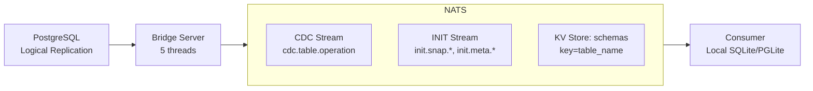

# PostgreSQL CDC → NATS Bridge


A lightweight (15MB), opinionated bridge for streaming PostgreSQL changes to NATS JetStream. Built with Zig for minimal overhead, includes table bootstrapping for consumer initialization.

⚠️ **Status**: Early stage, not yet battle-tested in production. Suitable for experimentation and non-critical workloads.



## Table of Contents

- [Overview](#overview)
- [Design Philosophy](#design-philosophy)
- [Prerequisites](#prerequisites)
- [Consumer Integration Guide](#consumer-integration-guide)
- [Running the Bridge](#running-the-bridge)
- [Message Formats](#message-formats)
- [Monitoring & Telemetry](#monitoring--telemetry)
- [Safety & Guarantees](#safety--guarantees)
- [Architecture](#architecture)
- [Comparison to Alternatives](#comparison-to-alternatives)
- [Build Instructions](#build-instructions)
- [Configuration](#configuration)

---

## Overview

### What It Does

**Two-phase data flow:**

1. **Bootstrap** (INIT stream): Consumer requests table snapshot → receives data in chunks
2. **Real-time CDC** (CDC stream): Consumer receives INSERT/UPDATE/DELETE events as they happen

**Key features:**
- Streams PostgreSQL changes using logical replication (pgoutput format)
- Publishes schemas to NATS KV store on startup
- Generates table snapshots on-demand (10K row chunks)
- MessagePack encoding for efficiency
- At-least-once delivery with idempotent message IDs
- Graceful shutdown with LSN acknowledgment
- 15MB Docker image, 10MB RAM usage
- ~60K events/s throughput (single-threaded)

### Use Case

**Perfect for:** Consumers wanting to mirror PostgreSQL tables locally (SQLite, PGLite, etc.) and stay synchronized with real-time changes.

**Example:** Edge applications, mobile apps, or analytics workers that need a local replica of specific tables without querying the main database.

---

## Design Philosophy

This bridge is an **experiment in minimalism**: can PostgreSQL CDC be done with 16MB and 5MB RAM while preserving correctness? The design makes deliberate trade-offs for simplicity and efficiency.

### 1. Opinionated Encoding: MessagePack

**Current default: MessagePack**
- Compact (~30% smaller than JSON)
- Type-safe (preserves int/float/binary distinctions)
- Fast encoding/decoding

**Future option:** `--format json` flag for browser compatibility (NATS supports WebSocket connections)

### 2. Single-Threaded per Bridge

**Design choice:** One bridge instance = one replication slot = sequential processing

**Rationale:**
- PostgreSQL WAL is inherently sequential
- Simpler LSN acknowledgment logic
- Scale horizontally (multiple bridges) instead of vertically

**To scale throughput:**
```bash
# Bridge 1: 60K events/s
./bridge --slot slot_1 --table users --port 9090

# Bridge 2: Another 60K events/s
./bridge --slot slot_2 --table orders --port 9091
```

**Trade-off:** Multiple processes vs single multi-threaded process. This approach prioritizes operational simplicity.

### 3. Two Independent ACK Flows

The system has **two separate acknowledgment flows** that work independently:

#### ACK Flow 1: WAL Preservation (Bridge ↔ PostgreSQL)

**The bridge's challenge:** When can we safely tell PostgreSQL to prune WAL?

```
PostgreSQL WAL → Bridge → NATS JetStream
              ↑            ↓
              └─── ACK after JetStream confirms
```

**How it works:**

1. Bridge receives WAL event from PostgreSQL
2. Bridge publishes to NATS JetStream (async)
3. **JetStream confirms** message is durably persisted (file storage)
4. Bridge ACKs that LSN to PostgreSQL
5. PostgreSQL can safely prune WAL up to that LSN

**Why this matters:**
- Bridge only ACKs after NATS has the data (no data loss)
- PostgreSQL can reclaim disk space safely
- If bridge crashes, PostgreSQL retains unpublished WAL

**Backpressure:**
- NATS slow/full → Bridge can't get JetStream ACK → Bridge stops ACK'ing PostgreSQL → WAL accumulates

#### ACK Flow 2: JetStream Pruning (Consumer ↔ NATS)

**The consumer's challenge:** When can JetStream prune delivered messages?

```
NATS JetStream → Consumer
       ↑              ↓
       └──── Consumer ACKs (or NAKs)
```

**How it works:**

1. Consumer pulls messages from JetStream
2. Consumer processes message
3. Consumer ACKs to JetStream (or NAKs on error)
4. JetStream tracks consumer position (durable consumer)
5. JetStream can prune messages acknowledged by all consumers

**Why this matters:**
- Consumer controls replay (NAK → redeliver)
- Durable consumer name survives restarts
- Multiple consumers can track independent positions

**Backpressure:**
- Consumer slow → JetStream buffers → Consumer catches up at own pace
- JetStream retention policies prevent unbounded growth

#### Why Two Flows Are Better Than One

**Bridge doesn't wait for consumers:**
- Bridge ACKs to PostgreSQL as soon as NATS has the data
- Consumer speed doesn't affect PostgreSQL WAL growth
- NATS JetStream handles the buffering/delivery problem

**Separation of concerns:**

| Component          | Responsibility                      | ACK Target                         |
| ------------------ | ----------------------------------- | ---------------------------------- |
| **Bridge**         | Get data from PG into NATS reliably | PostgreSQL (LSN)                   |
| **NATS JetStream** | Deliver to consumers durably        | N/A (handles both flows)           |
| **Consumer**       | Process data and track progress     | NATS JetStream (consumer position) |

This architecture keeps PostgreSQL WAL lean while allowing consumers to replay/lag independently.

### 4. Two-Stream Architecture

| Stream   | Purpose             | Retention     | Consumer Pattern        |
| -------- | ------------------- | ------------- | ----------------------- |
| **CDC**  | Real-time changes   | Short (1 min) | Continuous subscription |
| **INIT** | Bootstrap snapshots | Long (7 days) | One-time replay         |

**Why separate?**
- Different retention policies
- Consumer requests snapshots on-demand (not auto-pushed)
- Clear operational semantics

### 5. On-Demand Snapshots

**Flow:**
1. Bridge starts → publishes schemas to KV store immediately
2. Consumer fetches schemas when ready
3. Consumer publishes: `snapshot.request.{table}`
4. Bridge generates snapshot (COPY CSV, chunked)
5. Consumer reconstructs table from INIT stream
6. Consumer subscribes to CDC stream for updates

**Why on-demand?**
- No unnecessary work (only snapshot tables consumers need)
- Consumer controls timing (e.g., off-peak hours)
- Non-blocking (bridge continues CDC while snapshotting)

### Design Principles Summary

| Principle               | Manifestation                       | Benefit                           |
| ----------------------- | ----------------------------------- | --------------------------------- |
| **Simple > Clever**     | Single-threaded, horizontal scaling | Easy to debug, no race conditions |
| **Explicit > Implicit** | Consumer requests snapshots         | Predictable behavior              |
| **Correctness > Speed** | ACK only after JetStream confirms   | Zero data loss                    |
| **Small > Big**         | 15MB image, vendored dependencies   | Minimal operational overhead      |

**The bet:** PostgreSQL's logical replication + NATS JetStream already solve the hard problems (ordering, durability, idempotency). The bridge just connects them correctly.

---

## Prerequisites

### PostgreSQL Setup (Admin/DBA Task)

**Requires superuser privileges** (e.g., `postgres` user). The bridge uses a restricted `bridge_reader` user for security.

#### 1. Enable Logical Replication

Add to `postgresql.conf` or Docker command:
```
wal_level = logical
max_replication_slots = 10
max_wal_senders = 10
max_slot_wal_keep_size = 10GB
wal_sender_timeout = 300s  # 5 minutes
```

#### 2. Create Publication

```sql
-- Run as superuser
CREATE PUBLICATION cdc_pub FOR ALL TABLES;
```

To filter specific tables:
```sql
CREATE PUBLICATION cdc_pub FOR TABLE users, orders;
```

#### 3. Create Bridge User

```sql
-- Run as superuser
CREATE USER bridge_reader WITH REPLICATION PASSWORD 'secure_password';
GRANT CONNECT, CREATE ON DATABASE postgres TO bridge_reader;
GRANT USAGE ON SCHEMA public TO bridge_reader;
GRANT SELECT ON ALL TABLES IN SCHEMA public TO bridge_reader;

-- Auto-grant for future tables
ALTER DEFAULT PRIVILEGES IN SCHEMA public
    GRANT SELECT ON TABLES TO bridge_reader;
```

**Why two users?**
- **Superuser** (`postgres`): Creates publications (security-sensitive)
- **Bridge user** (`bridge_reader`): Restricted to SELECT + REPLICATION (least privilege)

See `init.sh` for a complete setup script.

---

### NATS JetStream Setup (Admin Task)

#### 1. Enable JetStream

```bash
nats-server -js -m 8222
```

Or via Docker:
```bash
docker run -p 4222:4222 -p 8222:8222 nats:latest -js -m 8222
```

#### 2. Create Streams

```bash
# CDC stream: Short retention for real-time events
nats stream add CDC \
  --subjects='cdc.>' \
  --storage=file \
  --retention=limits \
  --max-age=1m \
  --max-msgs=1000000 \
  --max-bytes=1G \
  --replicas=1

# INIT stream: Long retention for bootstrap data
nats stream add INIT \
  --subjects='init.>' \
  --storage=file \
  --retention=limits \
  --max-age=7d \
  --max-msgs=10000000 \
  --max-bytes=8G \
  --replicas=1
```

#### 3. Create KV Bucket for Schemas

```bash
nats kv add schemas --history=10 --replicas=1
```

#### 4. Optional: Configure Authentication

Example `nats-server.conf`:
```hocon
port: 4222

jetstream {
    store_dir: "/data"
    max_memory_store: 1GB
    max_file_store: 10GB
}

accounts {
  BRIDGE: {
    jetstream: {
      max_memory: 1GB
      max_file: 10GB
      max_streams: 10
      max_consumers: 10
    }
    users: [
      {user: "bridge_user", password: "bridge_password"}
    ]
  }
}
```

See `docker-compose.yml` for a complete Docker setup with PostgreSQL + NATS.

---

## Consumer Integration Guide

### Bootstrap Flow (First-Time Setup)

```
1. Consumer starts
2. Fetches schemas from NATS KV store
   GET kv://schemas/{table_name} → MessagePack schema
3. Checks if local DB needs bootstrap
4. If yes, publishes snapshot request
   PUBLISH snapshot.request.{table_name} (empty payload)
5. Bridge snapshot_listener receives request
6. Bridge generates snapshot in 10K row chunks
   → Publishes to init.snap.{table}.{snapshot_id}.{chunk}
7. Consumer receives chunks, reconstructs table
8. Consumer receives metadata on init.meta.{table}
9. Consumer subscribes to CDC stream for real-time updates
```

### Implementation Example (Elixir)

**1. Fetch Schemas**

```elixir
def fetch_schema(table_name) do
  case Gnat.Jetstream.API.KV.get_value(:gnat, "schemas", table_name) do
    schema_data when is_binary(schema_data) ->
      {:ok, schema} = Msgpax.unpack(schema_data)
      # schema = %{"table" => "users", "columns" => [...]}
      {:ok, schema}
    _ ->
      {:error, :not_found}
  end
end
```

**2. Request Snapshot**

```elixir
def request_snapshot(table_name) do
  # Check if INIT stream is empty (needs fresh snapshot)
  {:ok, stream_info} = Gnat.Jetstream.API.Stream.info(:gnat, "INIT")
  stream_messages = stream_info["state"]["messages"] || 0

  if stream_messages == 0 do
    # Request snapshot
    :ok = Gnat.pub(:gnat, "snapshot.request.#{table_name}", "")
    Logger.info("Requested snapshot for #{table_name}")
  end
end
```

**3. Subscribe to INIT Stream**

```elixir
# Create durable consumer
consumer_config = %Gnat.Jetstream.API.Consumer{
  durable_name: "my_init_consumer",
  stream_name: "INIT",
  filter_subject: "init.>",
  ack_policy: :explicit,
  ack_wait: 60_000_000_000,  # 60 seconds in nanoseconds
  max_deliver: 3
}

def handle_init_message(message) do
  {:ok, payload} = Msgpax.unpack(message.body)

  case payload do
    %{"operation" => "snapshot", "data" => rows} ->
      # Insert rows into local DB
      insert_bulk_rows(rows)
      {:ack, state}

    _ ->
      {:ack, state}
  end
end
```

**4. Subscribe to CDC Stream**

```elixir
consumer_config = %Gnat.Jetstream.API.Consumer{
  durable_name: "my_cdc_consumer",
  stream_name: "CDC",
  filter_subject: "cdc.users.>",  # Or "cdc.>" for all tables
  ack_policy: :explicit,
  max_batch: 100
}

def handle_cdc_message(message) do
  {:ok, payload} = Msgpax.unpack(message.body)

  case payload["operation"] do
    "INSERT" -> insert_row(payload["columns"])
    "UPDATE" -> update_row(payload["columns"])
    "DELETE" -> delete_row(payload["columns"])
  end

  {:ack, state}
end
```

See `consumer/lib/consumer/` for a complete Elixir example.

---

## Running the Bridge

### Basic Usage

```bash
./bridge --stream CDC,INIT \
         --slot cdc_slot \
         --publication cdc_pub \
         --port 9090
```

### Filter Specific Tables

```bash
./bridge --stream CDC,INIT \
         --slot cdc_slot \
         --publication cdc_pub \
         --table users,orders \
         --port 9090
```

### Environment Variables

```bash
# PostgreSQL connection
export PG_HOST=localhost
export PG_PORT=5432
export PG_USER=bridge_reader
export PG_PASSWORD=secure_password
export PG_DB=postgres

# NATS connection
export NATS_HOST=localhost
export NATS_BRIDGE_USER=bridge_user
export NATS_BRIDGE_PASSWORD=bridge_password

# Bridge configuration
export BRIDGE_PORT=9090
```

### Command-Line Options

```
Options:
  --stream <NAMES>       Comma-separated stream names (default: CDC,INIT)
  --slot <NAME>          Replication slot name (default: cdc_slot)
  --publication <NAME>   Publication name (default: cdc_pub)
  --table <NAMES>        Comma-separated table filter (default: all tables)
  --port <PORT>          HTTP telemetry port (default: 9090)
  --help, -h             Show this help message
```

### Docker Compose

```bash
# Start full stack (PostgreSQL + NATS + Bridge)
docker compose -f docker-compose.prod.yml up --build
```

See `docker-compose.prod.yml` for the complete setup.

### Horizontal Scaling

Run multiple bridge instances with different replication slots:

```bash
# Terminal 1: Users table (60K events/s)
./bridge --stream CDC,INIT --slot slot_1 --table users --port 9090

# Terminal 2: Orders table (60K events/s)
./bridge --stream CDC,INIT --slot slot_2 --table orders --port 9091

# Total: 120K events/s, independent failure domains
```

---

## Message Formats

> **Note**: Actual payloads use MessagePack binary encoding. JSON examples below show the logical structure for illustration.

### Schema (KV Store: `schemas.{table}`)

Published at bridge startup. Consumers fetch before requesting snapshots.

```json
{
  "table": "users",
  "schema": "public.users",
  "timestamp": 1765201228,
  "columns": [
    {
      "name": "id",
      "position": 1,
      "data_type": "integer",
      "is_nullable": false,
      "column_default": "nextval('users_id_seq'::regclass)"
    },
    {
      "name": "name",
      "position": 2,
      "data_type": "text",
      "is_nullable": false,
      "column_default": null
    },
    {
      "name": "email",
      "position": 3,
      "data_type": "text",
      "is_nullable": true,
      "column_default": null
    }
  ]
}
```

### Snapshot Metadata (INIT Stream: `init.meta.{table}`)

Published after all chunks. Tells consumer how many chunks to expect.

```json
{
  "snapshot_id": "snap-1765208480",
  "lsn": "0/191BFD0",
  "timestamp": 1765208480,
  "batch_count": 4,
  "row_count": 4000,
  "table": "users"
}
```

### Snapshot Chunk (INIT Stream: `init.snap.{table}.{snapshot_id}.{chunk}`)

10,000 rows per chunk (configurable in `config.zig`).

```json
{
  "table": "users",
  "operation": "snapshot",
  "snapshot_id": "snap-1765208480",
  "chunk": 3,
  "lsn": "0/191BFD0",
  "data": [
    {
      "id": "3001",
      "name": "User-3001",
      "email": "user3001@example.com",
      "created_at": "2025-12-08 13:45:21.719719+00"
    },
    {
      "id": "3002",
      "name": "User-3002",
      "email": "user3002@example.com",
      "created_at": "2025-12-08 13:45:22.123456+00"
    }
    // ... up to 10,000 rows
  ]
}
```

### CDC Event (CDC Stream: `cdc.{table}.{operation}`)

Real-time INSERT/UPDATE/DELETE events.

**Subject pattern:** `cdc.{table}.{operation}`
- `cdc.users.insert`
- `cdc.users.update`
- `cdc.users.delete`

**Message ID (for deduplication):** `{lsn}-{table}-{operation}`
- Example: `25cb3c8-users-insert`

**INSERT event:**
```json
{
  "table": "users",
  "operation": "INSERT",
  "relation_id": 16384,
  "lsn": "0/25cb3c8",
  "columns": [
    {"name": "id", "value": 1},
    {"name": "name", "value": "Alice"},
    {"name": "email", "value": "alice@example.com"},
    {"name": "created_at", "value": "2025-12-10 10:30:00+00"}
  ]
}
```

**UPDATE event:**
```json
{
  "table": "users",
  "operation": "UPDATE",
  "relation_id": 16384,
  "lsn": "0/25cb4d0",
  "columns": [
    {"name": "id", "value": 1},
    {"name": "name", "value": "Alice Smith"},
    {"name": "email", "value": "alice.smith@example.com"},
    {"name": "created_at", "value": "2025-12-10 10:30:00+00"}
  ]
}
```

**DELETE event:**
```json
{
  "table": "users",
  "operation": "DELETE",
  "relation_id": 16384,
  "lsn": "0/25cb5e8",
  "columns": [
    {"name": "id", "value": 1},
    {"name": "name", "value": "Alice Smith"},
    {"name": "email", "value": "alice.smith@example.com"},
    {"name": "created_at", "value": "2025-12-10 10:30:00+00"}
  ]
}
```

---

## Monitoring & Telemetry

The bridge provides telemetry through multiple channels:


### 1. Prometheus Metrics Endpoint

**HTTP GET** `http://localhost:9090/metrics`

Returns metrics in Prometheus text format:

```prometheus
bridge_uptime_seconds 331
bridge_wal_messages_received_total 1797
bridge_cdc_events_published_total 288
bridge_last_ack_lsn 25509096
bridge_connected 1
bridge_reconnects_total 0
bridge_nats_reconnects_total 0
bridge_last_processing_time_us 2
bridge_slot_active 1
bridge_wal_lag_bytes 51344
```

Configure Prometheus to scrape this endpoint:

```yaml
scrape_configs:
  - job_name: 'cdc_bridge'
    static_configs:
      - targets: ['localhost:9090']
```

### 2. JSON Status Endpoint

**HTTP GET** `http://localhost:9090/status`

Returns bridge status as JSON:

```json
{
  "status": "connected",
  "uptime_seconds": 331,
  "wal_messages_received": 1797,
  "cdc_events_published": 288,
  "current_lsn": "0/1832ce8",
  "is_connected": true,
  "reconnect_count": 0,
  "nats_reconnect_count": 0,
  "last_processing_time_us": 2,
  "slot_active": true,
  "wal_lag_bytes": 51344,
  "wal_lag_mb": 0
}
```

### 3. Structured Log Metrics (for Grafana Alloy/Loki)

The bridge emits structured metric logs to **stdout** every **15 seconds**:

```log
info(bridge): METRICS uptime=15 wal_messages=2 cdc_events=0 lsn=0/183f680 connected=1 reconnects=0 nats_reconnects=0 lag_bytes=51608 slot_active=1
```

Configure Grafana Alloy to parse these logs:

```hcl
loki.source.file "bridge_logs" {
  targets = [
    {__path__ = "/var/log/bridge/*.log"},
  ]
  forward_to = [loki.process.extract_metrics.receiver]
}

loki.process "extract_metrics" {
  stage.regex {
    expression = "METRICS uptime=(?P<uptime>\\d+) wal_messages=(?P<wal_msgs>\\d+) cdc_events=(?P<cdc_events>\\d+)"
  }

  stage.metrics {
    metric.counter {
      name   = "bridge_wal_messages_total"
      source = "wal_msgs"
    }
    metric.counter {
      name   = "bridge_cdc_events_total"
      source = "cdc_events"
    }
  }

  forward_to = [loki.write.default.receiver]
}
```

### 4. Health Check Endpoint

**HTTP GET** `http://localhost:9090/health`

Returns:
```json
{"status":"ok"}
```

Status: `200 OK` when bridge HTTP server is running.

Use for Docker health checks, Kubernetes probes, or load balancers.

### 5. Graceful Shutdown Endpoint

**HTTP POST** `http://localhost:9090/shutdown`

Initiates graceful shutdown:

```bash
curl -X POST http://localhost:9090/shutdown
```

Shutdown sequence:
1. Sets global shutdown flag
2. Drains internal event queue
3. Sends final ACK to PostgreSQL
4. Closes connections cleanly
5. Exits with summary statistics

### 6. Stream Management Endpoints

**Get stream info:**
```bash
curl "http://localhost:9090/streams/info?stream=CDC" | jq
```

**Purge stream messages:**
```bash
curl -X POST "http://localhost:9090/streams/purge?stream=TEST"
```

**Create/delete streams:**
```bash
curl -X POST "http://localhost:9090/streams/create?stream=TEST&subjects=test.>"
curl -X POST "http://localhost:9090/streams/delete?stream=TEST"
```

---

## Safety & Guarantees

### At-Least-Once Delivery

**The guarantee:**
- Bridge only ACKs to PostgreSQL **after** NATS JetStream confirms receipt
- PostgreSQL can safely prune WAL after ACK
- No data loss between Postgres and NATS

**If bridge crashes:**
- PostgreSQL retains WAL from last ACK'd LSN
- Bridge restarts from last ACK'd position
- JetStream deduplication (Msg-ID) prevents duplicates

**If NATS crashes:**
- Bridge stops ACK'ing to PostgreSQL
- WAL accumulates (up to `max_slot_wal_keep_size=10GB`)
- NATS recovers → Bridge resumes publishing
- No data loss (WAL preserved)

### Idempotent Delivery

**Message ID pattern:** `{lsn}-{table}-{operation}`
- Example: `25cb3c8-users-insert`

**NATS JetStream deduplication:**
- Duplicate Msg-IDs are rejected
- Ensures exactly-once semantics even with retries

### Durability

**PostgreSQL side:**
- Logical replication slot preserves WAL
- `max_slot_wal_keep_size=10GB` prevents unbounded growth

**NATS JetStream side:**
- File storage (`.storage=file`) survives restarts
- Durable consumers track position across restarts

**Consumer side:**
- Durable consumer name persists progress
- Survives consumer restarts

### Schema Consistency

**Snapshot consistency:**
- Each snapshot includes LSN for consistency point
- Consumer can reconstruct table state at that LSN

**CDC event ordering:**
- PostgreSQL WAL is sequential
- Bridge preserves order (single-threaded SPSC queue)
- NATS JetStream delivers in order

### Graceful Shutdown

**Shutdown sequence:**
1. Signal handler (SIGINT/SIGTERM) sets stop flag
2. Main thread finishes processing current WAL message
3. Batch publisher drains internal queue
4. Bridge sends final ACK to PostgreSQL (last confirmed LSN)
5. All threads join cleanly

**Guarantees:**
- No in-flight events lost
- PostgreSQL knows exact resume point
- Clean restart from last ACK'd LSN

---

## Architecture

### Thread Model (5 Threads)

1. **Main thread**: Consumes PostgreSQL CDC, parses pgoutput format
2. **Batch publisher thread**: Batches events, encodes MessagePack, publishes to NATS CDC stream
3. **WAL monitor thread**: Tracks replication slot lag every 30 seconds
4. **HTTP telemetry thread**: Serves `/metrics`, `/health`, `/status`, `/shutdown`
5. **Snapshot listener thread**: Subscribes to `snapshot.request.>`, generates snapshots on-demand

### Lock-Free Queue (SPSC)

**Producer-Consumer pattern:**
- **Producer**: Main thread (reading WAL)
- **Consumer**: Batch publisher thread
- **Queue**: Lock-free ring buffer (32768 slots, 2^15)

**Why lock-free?**
- Zero contention (single producer, single consumer)
- Cache-friendly (separate cache lines for indices)
- Wait-free operations (no blocking)

**Dual purpose:**

1. **Thread separation** (primary): Decouple WAL reading from NATS publishing
2. **Resilience buffer** (critical): Absorb WAL events during NATS reconnection

**How it handles NATS outages:**

```
NATS goes down at T=0
├─ Main thread continues reading WAL → pushes to queue
├─ Flush thread can't publish → queue fills up
├─ Queue fills (32768 slots) → ~546ms buffer at 60K events/s
├─ Queue full → Main thread backs off (sleeps 1ms per attempt)
├─ PostgreSQL WAL starts accumulating (controlled)
│
NATS reconnects at T=1000ms+ (reconnect_wait, queue covers 54% of retry)
├─ Flush thread resumes publishing
├─ Queue drains rapidly (~546ms of buffered events)
└─ Bridge catches up, resumes ACK'ing PostgreSQL
```

**Backpressure cascade:**

```
NATS outage → Queue fills → Main thread slows → PostgreSQL WAL accumulates
                                                         ↓
                                           (up to max_slot_wal_keep_size=10GB)
```

**Queue size trade-offs:**

| Queue Size          | Buffer Duration<br/>(at 60K events/s) | Memory Impact | Pros                    | Cons                              |
| ------------------- | ------------------------------------- | ------------- | ----------------------- | --------------------------------- |
| 4096                | ~68ms                                 | ~256KB        | Minimal memory          | Too small for reconnections       |
| 16384               | ~273ms                                | ~1MB          | Good balance            | Marginal for multi-second outages |
| **32768** (current) | **~546ms**                            | **~2MB**      | **Covers most outages** | **None (negligible cost)**        |

**Why 32768 is the sweet spot:**
- **NATS reconnection**: 1s between attempts, 546ms covers 54% of retry interval
- **PostgreSQL reconnection**: 5s delay, queue absorbs burst during reconnection
- **Production-grade**: 546ms buffer handles real-world jitter and blips
- **Cost**: 2MB RAM (12MB total) = negligible for the resilience gain
- **Graceful degradation**: Queue full → controlled WAL accumulation (not instant flood)

**Graceful degradation:**
- Queue absorbs microsecond-scale jitter
- PostgreSQL WAL absorbs second-scale outages
- `max_slot_wal_keep_size=10GB` absorbs minute-scale outages
- Beyond that → alerts fire (intentional)

### Data Flow

```
PostgreSQL WAL
    ↓
Main Thread (parse pgoutput)
    ↓
SPSC Queue (lock-free)
    ↓
Batch Publisher Thread
    ↓ (batch: 500 events OR 100ms OR 256KB)
MessagePack Encoding
    ↓
NATS JetStream (async publish)
    ↓ (JetStream ACK)
PostgreSQL LSN ACK
```

### Memory Management

**Arena allocator:**
- Reused for each WAL message
- Retains capacity across messages
- Avoids allocator churn at high throughput

**Ownership transfer:**
- Decoded column values transferred via SPSC queue
- Batch publisher thread frees after publishing
- No shared state between threads

### Replication Slot Management

**On startup:**
1. Bridge creates replication slot (if not exists)
2. Gets current LSN to skip historical data
3. Starts streaming from current LSN

**During operation:**
- Bridge sends status updates every 1 second OR 1MB data
- PostgreSQL prunes WAL up to last ACK'd LSN

**On shutdown:**
- Bridge sends final ACK with last confirmed LSN
- Replication slot preserves position for restart

### Reconnection Handling

**PostgreSQL reconnection:**
- Connection lost → Bridge waits 5 seconds
- Gets latest LSN
- Reconnects and resumes streaming
- Metrics track reconnection count

**NATS reconnection:**
- Automatic (handled by nats.c library)
- Max attempts: -1 (infinite)
- Wait between attempts: 1 second (aggressive for CDC)
- Flush timeout: 10 seconds (allows ~10 retry attempts)

---

## Comparison to Alternatives

### vs. Debezium (The Proven Solution)

|                        | This Bridge                     | Debezium                              |
| ---------------------- | ------------------------------- | ------------------------------------- |
| **Maturity**           | ⚠️ Experimental                  | ✅ Battle-tested (years in production) |
| **Footprint**          | 15MB / 10MB RAM                 | 500MB+ / 512MB+ RAM                   |
| **Architecture**       | NATS-native                     | Kafka-centric                         |
| **Deployment**         | Single binary                   | Kafka Connect cluster                 |
| **Throughput**         | ~60K events/s (single-threaded) | High (multi-threaded)                 |
| **Connectors**         | PostgreSQL → NATS only          | 100+ sources/sinks                    |
| **Enterprise Support** | ❌ None                          | ✅ Available                           |

**When to use Debezium instead:**
- You need proven reliability (battle-tested in thousands of deployments)
- You're already running Kafka infrastructure
- You need connectors for MySQL, MongoDB, Oracle, etc.
- You need enterprise support contracts

**When to try this bridge:**
- You're using NATS (or evaluating it)
- You value small footprint / simple deployment
- You're comfortable with early-stage software
- You only need PostgreSQL → NATS

### vs. Benthos / pgstream

**Benthos** (Redpanda):
- General-purpose streaming (many sources/sinks)
- ~20-30MB footprint
- Flexible but less CDC-optimized

**pgstream** (Xata):
- Go-based CDC library
- ~15-20MB footprint
- Similar philosophy (lightweight)
- Multiple destinations (Kafka, webhooks, etc.)

**This bridge:**
- NATS-specific (not general-purpose)
- Built-in bootstrapping (not manual)
- Zig-native (compiled, minimal overhead)

### The Honest Take

This bridge might carve out a niche for NATS-first teams who want turnkey CDC without heavy infrastructure. Or it might not—time will tell. 🤷

If you're betting on mission-critical CDC, use Debezium. If you're exploring NATS and want a lightweight CDC solution, this is worth trying.

---

## Build Instructions

### Prerequisites

- Zig 0.15.2 or later
- Docker & Docker Compose (for PostgreSQL and NATS)
- CMake (for building nats.c library)

### 1. Build Vendored Libraries (One-Time Setup)

```bash
# Build nats.c v3.12.0
./build_nats.sh

# Build libpq for PostgreSQL 18.1
./build_libpq.sh
```

This compiles:
- `nats.c` → `libs/nats-install/`
- `libpq` → `libs/libpq-install/`

### 2. Start Infrastructure

```bash
# Start PostgreSQL with logical replication enabled
docker compose up -d postgres

# Start NATS server with JetStream enabled
docker compose up -d nats-server nats-config-gen nats-init
```

### 3. Build the Bridge

```bash
zig build
```

Output: `./zig-out/bin/bridge`

### 4. Run Tests

```bash
zig build test
```

---

## Configuration

All configuration constants are centralized in `src/config.zig`.

### Key Settings

**Snapshot configuration:**
- Chunk size: `10_000` rows per batch
- Subject pattern: `init.snap.{table}.{snapshot_id}.{chunk}`
- Metadata subject: `init.meta.{table}`
- Request subject: `snapshot.request.{table}`

**CDC configuration:**
- Batch size: `500` events OR `100ms` OR `256KB` (whichever first)
- Subject pattern: `cdc.{table}.{operation}`
- Message ID: `{lsn}-{table}-{operation}`

**NATS configuration:**
- Max reconnect attempts: `-1` (infinite)
- Reconnect wait: `2000ms`
- Flush timeout: `10_000ms` (10 seconds)
- Status update interval: `1` second OR `1MB` data

**WAL monitoring:**
- Check interval: `30` seconds
- Warning threshold: `512MB`
- Critical threshold: `1GB`

**Buffer sizes:**
- SPSC queue: `32768` slots (2^15, ~546ms buffer at 60K events/s)
- Subject buffer: `128` bytes
- Message ID buffer: `128` bytes

See `src/config.zig` for all tunables.

---

## Project Structure

```
├── src/
│   ├── bridge.zig              # Main application entry point
│   ├── config.zig              # Centralized configuration
│   ├── wal_stream.zig          # PostgreSQL replication stream
│   ├── pgoutput.zig            # pgoutput format parser
│   ├── nats_publisher.zig      # NATS JetStream publisher
│   ├── nats_kv.zig             # NATS KV store wrapper
│   ├── batch_publisher.zig     # Synchronous batch publisher
│   ├── async_batch_publisher.zig # Async batch publisher with SPSC queue
│   ├── spsc_queue.zig          # Lock-free single-producer single-consumer queue
│   ├── schema_publisher.zig    # Schema publishing to KV store
│   ├── snapshot_listener.zig   # Snapshot request listener
│   ├── wal_monitor.zig         # WAL lag monitoring
│   ├── http_server.zig         # HTTP telemetry server
│   ├── metrics.zig             # Metrics tracking
│   └── pg_conn.zig             # PostgreSQL connection helpers
├── libs/
│   ├── nats.c/                 # Vendored nats.c v3.12.0 source
│   ├── nats-install/           # Built nats.c library
│   └── libpq-install/          # Built libpq library
├── consumer/                   # Elixir consumer example
│   └── lib/consumer/
│       ├── application.ex      # Consumer app setup
│       ├── cdc_consumer.ex     # CDC stream consumer
│       └── init_consumer.ex    # INIT stream consumer (bootstrap)
├── build.zig                   # Zig build configuration
├── build.zig.zon               # Package dependencies
├── docker-compose.yml          # Base infrastructure setup
├── docker-compose.prod.yml     # Production setup with bridge
├── init.sh                     # PostgreSQL initialization script
└── nats-server.conf.template   # NATS server configuration
```

---

## Dependencies

**Managed via `build.zig.zon`:**
- [zig-msgpack](https://github.com/zigcc/zig-msgpack) - MessagePack encoding

**Vendored:**
- [nats.c](https://github.com/nats-io/nats.c) v3.12.0 - NATS client (C library)
- [libpq](https://www.postgresql.org/docs/current/libpq.html) PostgreSQL 18.1

---

## Testing

### End-to-End CDC Pipeline Test

**Terminal 1 - Start the bridge:**
```bash
./zig-out/bin/bridge --stream CDC,INIT
```

**Terminal 2 - Generate CDC events:**
```bash
cd consumer && iex -S mix

# Generate 100 INSERT events
iex> Producer.run_test(100)

# Parallel load test: 100 batches of 10 events each
iex> Stream.interval(500) |> Stream.take(100) |> Task.async_stream(fn _ -> Producer.run_test(10) end) |> Enum.to_list()
```

### HTTP Endpoint Tests

```bash
# Health check
curl http://localhost:9090/health

# Bridge status
curl http://localhost:9090/status | jq

# Prometheus metrics
curl http://localhost:9090/metrics

# Stream management
curl "http://localhost:9090/streams/info?stream=CDC" | jq

# Graceful shutdown
curl -X POST http://localhost:9090/shutdown
```

### Monitoring Replication Slot

```bash
docker exec -it postgres psql -U postgres -c "
  SELECT slot_name, active,
         pg_size_pretty(pg_wal_lsn_diff(pg_current_wal_lsn(), restart_lsn)) as lag
  FROM pg_replication_slots
  WHERE slot_name = 'cdc_slot';
"
```

---

## Roadmap

**Planned enhancements:**
- [ ] `--format json` flag for browser-friendly encoding
- [ ] Schema change notifications (publish to NATS on relation_id change)
- [ ] Compression options (`--compress gzip|lz4|zstd`)
- [ ] Multiple publication support (`--publication pub1,pub2`)
- [ ] Metrics export to StatsD/InfluxDB

**Open questions:**
- Will horizontal scaling prove simpler than multi-threading?
- Should JSON be the default instead of MessagePack?
- Can we reach 100K+ events/s per instance with optimizations?

**Contributions welcome!** This is a learning project as much as a tool. If you find it useful (or find gaps), feedback is valuable.

---

## License

This project uses:
- [nats.c](https://github.com/nats-io/nats.c) (Apache 2.0)
- [zig-msgpack](https://github.com/zigcc/zig-msgpack) (MIT)

---

## Notes

- The nats.c library is built with TLS enabled
- The library is statically linked to avoid runtime dependencies
- PostgreSQL logical replication requires `wal_level=logical`
- All C code is compiled with `-std=c11`

**Kill zombie processes:**
```bash
ps aux | grep bridge | grep -v grep | awk '{print $2}' | xargs kill
```
